# Data Science Programming — Session 1
## Python from scratch: build, decide, repeat, and organize data

This session builds a common programming foundation with Python. The goal is not to memorize syntax, but to understand how to express instructions, represent data, make decisions, repeat processes, and organize information to solve problems.

> **Core idea:** a program is a sequence of instructions that transforms data into results.

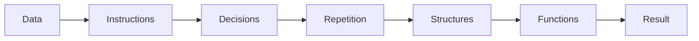

---

## 1. Running code in a notebook

A notebook combines text, code, and results in cells. Each code cell can be executed independently, although it is usually best to move from top to bottom to keep a consistent state.

```text
┌─────────────────────────────────────────────┐
│ Markdown cell                               │
│ Explains an idea                            │
├─────────────────────────────────────────────┤
│ Code cell                                   │
│ name = "Ana"                                │
│ print(name)                                 │
├─────────────────────────────────────────────┤
│ Output                                      │
│ Ana                                         │
└─────────────────────────────────────────────┘
```

In Google Colab or Jupyter, a variable created in one cell can be used by later cells while the environment remains active.

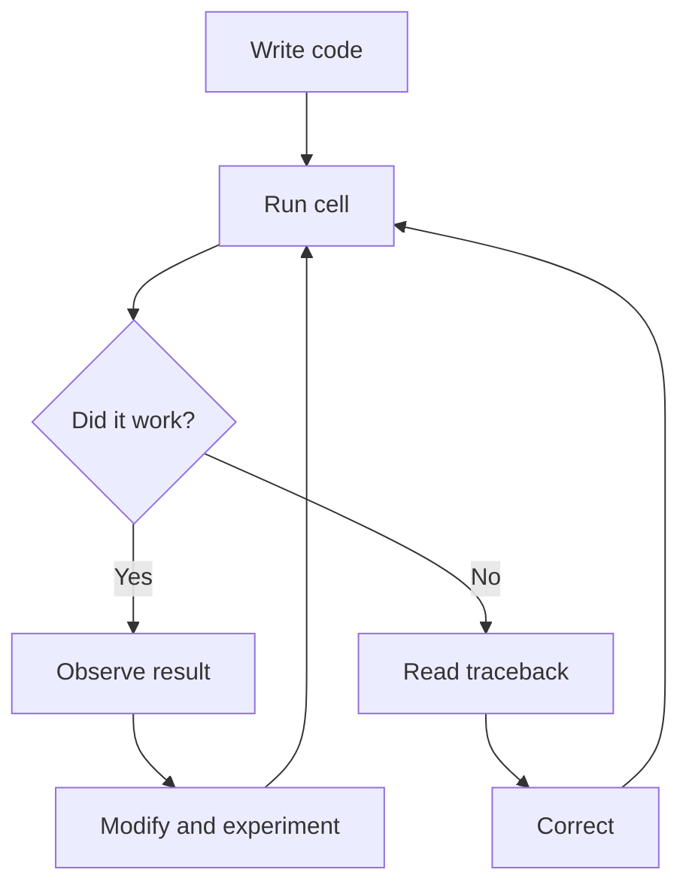

### `print()`: displaying information

`print()` sends information to the output.

```python
print("Hello, Data Science")
print("I am writing my first program")
```

The output is visible, but `print()` does not by itself store the displayed value.

---

## 2. Variables: names associated with values

A variable assigns a name to a value.

```python
name = "Ana"
age = 30
height = 1.65
```

Visually:

```text
name   ─────────► "Ana"
age    ─────────► 30
height ─────────► 1.65
```

The `=` symbol represents **assignment**.

```text
variable_name = value
```

The variable can be reused:

```python
print(name)
print(age)
print(height)
```

### 2.1 Basic data types

Python distinguishes values according to their type.

| Type | Meaning | Examples |
|---|---|---|
| `int` | integer number | `5`, `-3`, `100` |
| `float` | decimal number | `3.14`, `1.65` |
| `str` | text | `"Hello"`, `"30"` |
| `bool` | logical value | `True`, `False` |

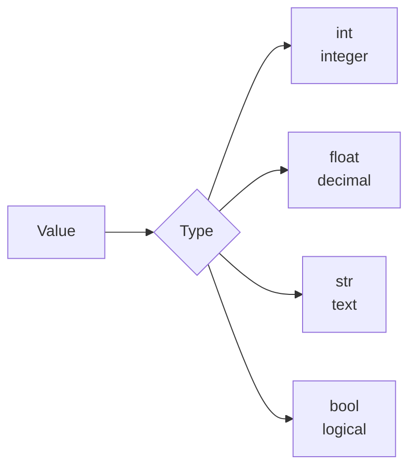

`type()` lets us inspect a value's type.

```python
print(type(30))
print(type("30"))
```

Although they look similar, `30` and `"30"` do not mean the same thing:

```text
30       → int → number
"30"     → str → text
```

The type determines which operations are valid.

---

## 3. Operators: Python as a calculator

Arithmetic operators let us build numerical expressions.

| Operator | Operation | Example |
|---|---|---|
| `+` | addition | `10 + 3` |
| `-` | subtraction | `10 - 3` |
| `*` | multiplication | `10 * 3` |
| `/` | division | `10 / 3` |
| `//` | floor division | `10 // 3` |
| `%` | remainder | `10 % 3` |
| `**` | exponentiation | `10 ** 2` |

```python
a = 10
b = 3

print(a + b)
print(a - b)
print(a * b)
print(a / b)
print(a // b)
print(a ** 2)
print(a % b)
```

### 3.1 Operations with text

For strings, some operators behave differently.

```python
name = "Ana"
last_name = "Garcia"

full_name = name + " " + last_name
print(full_name)

print("Hello! " * 3)
```

```text
"Data" + " Science"  → "Data Science"
"Hi! " * 3           → "Hi! Hi! Hi! "
```

### Incompatible types

Not every operation makes sense between different types.

```python
age = 30
print("I am " + age + " years old")
```

The program produces a `TypeError` because it tries to concatenate a `str` and an `int`.

One solution is explicit conversion:

```python
print("I am " + str(age) + " years old")
```

A more readable option is an **f-string**.

---

## 4. f-strings: combining text and variables

An f-string lets us insert expressions inside text.

```python
name = "Ana"
age = 30

print(f"{name} is {age} years old")
```

The general structure is:

```text
f"text {expression} text"
```

It can also format numbers.

```python
price = 1_250_000
print(f"Total: ${price:,}")

average = 4.23456
print(f"Average: {average:.2f}")

discount = 0.15
print(f"Discount: {discount:.0%}")
```

| Format | Effect |
|---|---|
| `:,` | thousands separator |
| `:.2f` | two decimal places |
| `:.0%` | percentage with no decimals |

---

## 5. Decisions with `if`, `elif`, and `else`

A program can choose different paths according to a condition.

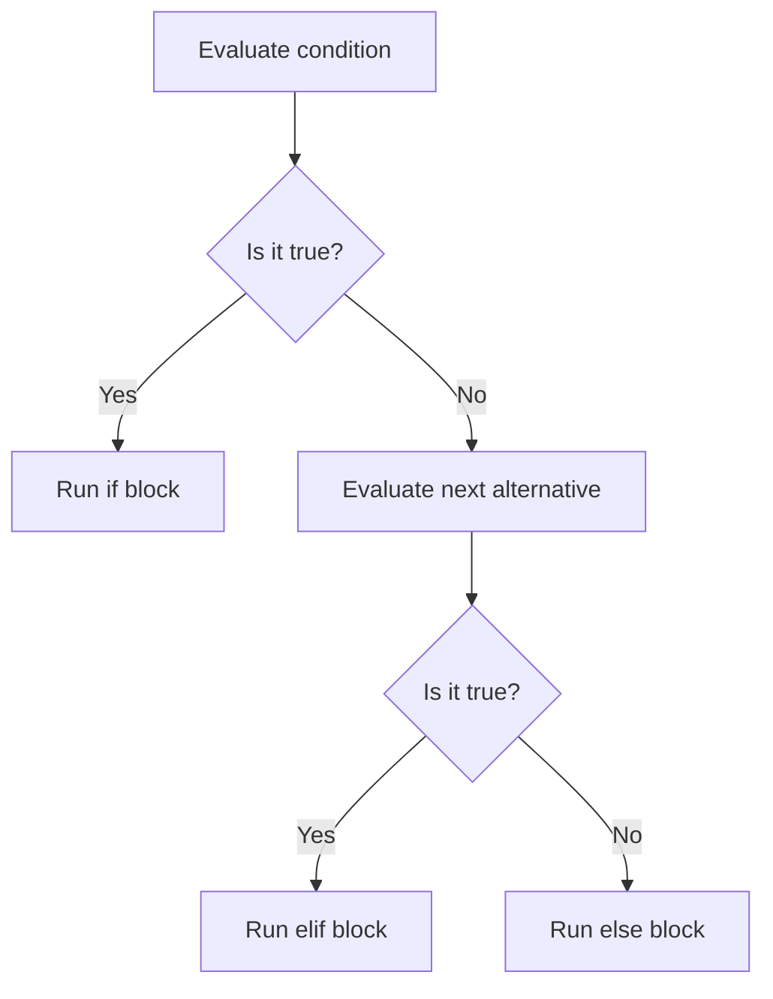

### Comparison operators

| Operator | Meaning |
|---|---|
| `==` | equal to |
| `!=` | not equal to |
| `>` | greater than |
| `<` | less than |
| `>=` | greater than or equal to |
| `<=` | less than or equal to |

Example:

```python
age = 20

if age >= 18:
    print("Adult")
else:
    print("Minor")
```

With multiple alternatives:

```python
age = 15

if age >= 18:
    print("Can vote")
elif age >= 13:
    print("Teenager")
else:
    print("Child")
```

### 5.1 Indentation is part of the syntax

Python uses indentation to indicate which instructions belong to a block.

```text
if condition:
│   instruction inside the if
│   another instruction
│
└── block ends when indentation returns
```

Correct:

```python
if age >= 18:
    print("Can vote")
```

Incorrect:

```python
if age >= 18:
print("Can vote")
```

Missing indentation produces an `IndentationError`.

---

## 6. Repetition: `for` and `while`

Many data tasks require repeating an operation.

```text
item 1 ─┐
item 2 ─┼──► same operation ───► results
item 3 ─┤
item 4 ─┘
```

### 6.1 `for`: iterating over a sequence

`for` is useful when we want to traverse the elements of a collection or range.

```python
for number in range(1, 6):
    print(number)
```

### `range()`

| Expression | Produced values |
|---|---|
| `range(5)` | `0, 1, 2, 3, 4` |
| `range(1, 6)` | `1, 2, 3, 4, 5` |
| `range(0, 10, 2)` | `0, 2, 4, 6, 8` |

We can also iterate through a collection:

```python
friends = ["Ana", "Luis", "Sofia"]

for friend in friends:
    print(f"Hello, {friend}!")
```

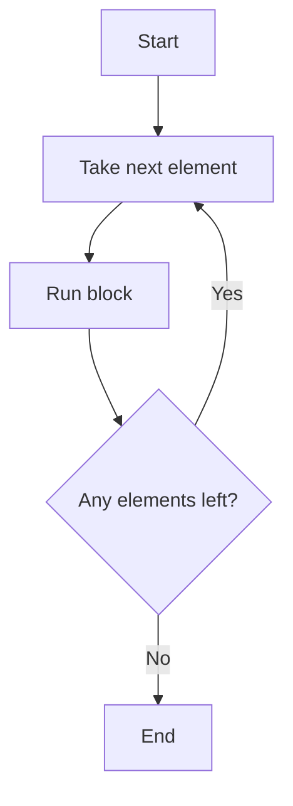

### 6.2 `while`: repeat while a condition is true

```python
balance = 1000

while balance > 0:
    print(f"Current balance: {balance}")
    balance = balance - 300

print("Balance depleted")
```

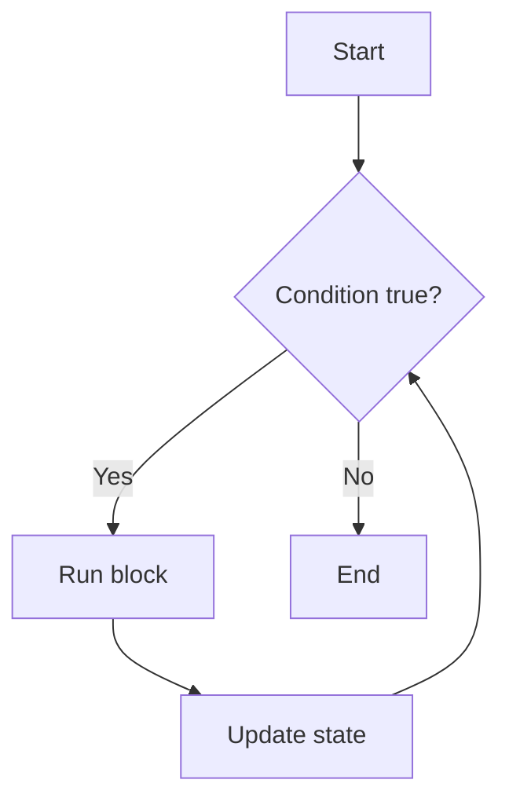

The condition must be able to change. If it never becomes false, the result is an **infinite loop**.

---

## 7. Lists: ordered, mutable collections

A list groups multiple values.

```python
products = ["Coffee", "Bread", "Milk", "Cheese"]
```

### Indexes

Python starts counting at `0`.

```text
index         0          1          2          3
          ┌──────────┬─────────┬──────────┬──────────┐
list   →  │ "Coffee" │ "Bread" │ "Milk"   │ "Cheese" │
          └──────────┴─────────┴──────────┴──────────┘
                                                ▲
                                               -1
```

```python
print(products[0])
print(products[2])
print(products[-1])
```

`len()` returns the number of elements:

```python
print(len(products))
```

### 7.1 Modifying lists

| Operation | Effect |
|---|---|
| `list.append(x)` | adds `x` to the end |
| `list.remove(x)` | removes first occurrence |
| `list[i] = x` | replaces an element |
| `sum(list)` | adds numeric elements |
| `max(list)` | gets the largest |
| `min(list)` | gets the smallest |
| `sorted(list)` | returns an ordered version |

```python
prices = [3500, 1200, 4800, 12000]

prices.append(2000)
prices[0] = 4000

print(sum(prices))
print(max(prices))
print(sum(prices) / len(prices))
```

---

## 8. Tuples: grouped data that does not change

A tuple is an ordered sequence similar to a list, but it is **immutable**.

```python
point = (4.5, 3.2)
product = ("Coffee", 3500)
```

```text
LIST                     TUPLE
[ "Coffee", "Bread" ]    ( "Coffee", 3500 )
        │                         │
    mutable                  immutable
```

### Lists and tuples

| Feature | List | Tuple |
|---|---|---|
| Syntax | `[ ]` | `( )` |
| Ordered | Yes | Yes |
| Index access | Yes | Yes |
| Mutable | Yes | No |
| Typical use | collection that changes | small stable record |

Tuples are useful for grouping related values:

```python
catalog = [
    ("Coffee", 3500),
    ("Bread", 1200),
    ("Milk", 4800)
]
```

Python can unpack each tuple:

```python
for product_name, price in catalog:
    print(f"{product_name}: ${price:,}")
```

---

## 9. Dictionaries: associating keys with values

A dictionary organizes data as **key: value** pairs.

```python
prices = {
    "Coffee": 3500,
    "Bread": 1200,
    "Milk": 4800
}
```

```text
┌─────────────┬─────────┐
│ key         │ value   │
├─────────────┼─────────┤
│ "Coffee"    │ 3500    │
│ "Bread"     │ 1200    │
│ "Milk"      │ 4800    │
└─────────────┴─────────┘
```

Unlike a list, we do not search by position:

```python
print(prices["Coffee"])
```

We can add new keys:

```python
prices["Eggs"] = 900
```

### 9.1 Iterating over a dictionary

```python
for product, price in prices.items():
    print(f"{product}: ${price:,}")
```

Useful methods:

| Expression | Result |
|---|---|
| `dictionary.keys()` | keys |
| `dictionary.values()` | values |
| `dictionary.items()` | key-value pairs |

### 9.2 Missing keys: `KeyError` and `.get()`

This fails when the key does not exist:

```python
prices["Rice"]
```

It produces a `KeyError`.

`.get()` lets us provide a fallback value:

```python
prices.get("Rice", 0)
```

Membership can also be checked:

```python
if "Rice" in prices:
    print("Rice is available")
else:
    print("Rice is not in the catalog")
```

---

## 10. Nested structures

Data structures can be combined.

```python
supermarket = {
    "Fruit": [
        ("Apple", 4500),
        ("Banana", 2800)
    ],
    "Dairy": [
        ("Milk", 4800),
        ("Cheese", 12000),
        ("Yogurt", 3200)
    ]
}
```

Conceptually:

```text
supermarket
│
├── "Fruit"
│   ├── ("Apple", 4500)
│   └── ("Banana", 2800)
│
└── "Dairy"
    ├── ("Milk", 4800)
    ├── ("Cheese", 12000)
    └── ("Yogurt", 3200)
```

It can also be visualized as:

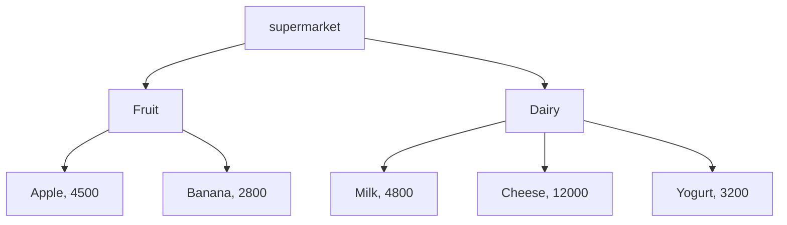

Accessing nested structures means moving through one level at a time:

```python
supermarket["Dairy"][0]
supermarket["Dairy"][0][0]
```

```text
supermarket["Dairy"]       → list
          [0]              → first tuple
             [0]           → product name
```

---

## 11. Functions: packaging reusable work

A function groups instructions under a name.

```python
def greet(name):
    message = f"Hello, {name}!"
    return message
```

General structure:

```python
def function_name(parameter1, parameter2):
    # instructions
    return result
```

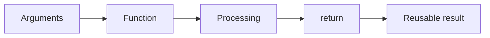

Defining a function does not execute it:

```python
def greet(name):
    return f"Hello, {name}!"

message = greet("Ana")
```

### 11.1 Parameters and arguments

```text
def greet(name):
          ▲
          └── parameter

greet("Ana")
       ▲
       └── argument
```

### 11.2 `return` is not the same as `print()`

This difference is fundamental.

```python
def add_badly(a, b):
    print(a + b)

def add_well(a, b):
    return a + b
```

`print()`:

```text
function
  │
  └── displays 5
         │
         └── does not return that 5 to the program
```

`return`:

```text
function
  │
  └── returns 5
         │
         ├── store it
         ├── multiply it
         ├── compare it
         └── pass it to another function
```

If a function has no `return`, Python implicitly returns `None`.

```python
result = add_badly(2, 3)
print(result)
# None
```

---

## 12. Combining concepts: from isolated pieces to a program

Real programs combine multiple structures and mechanisms.

```text
DICTIONARY
     │
     ▼
categories
     │
     ▼
LISTS
     │
     ▼
TUPLES (product, price)
     │
     ▼
FOR iterates
     │
     ▼
IF decides
     │
     ▼
FUNCTIONS calculate
     │
     ▼
F-STRINGS present
```

Conceptual coffee shop example:

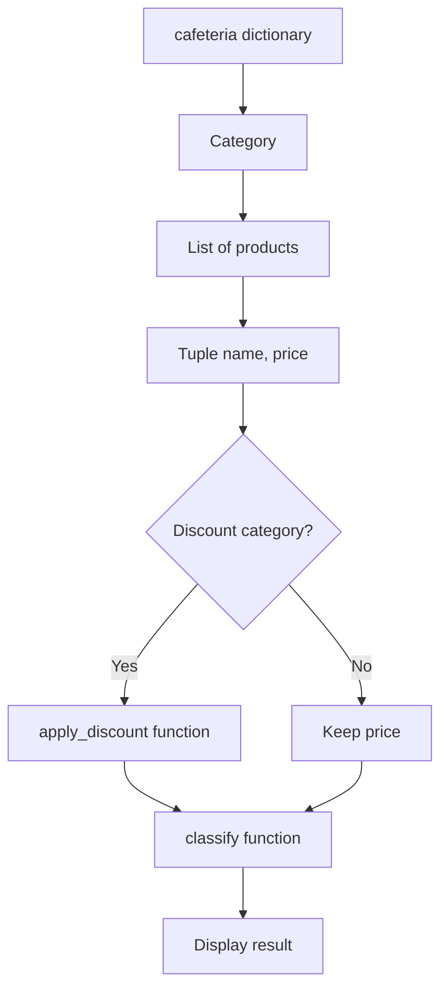

A discount function:

```python
def apply_discount(price, percentage):
    return price * (1 - percentage)
```

A classification function:

```python
def classify(price):
    if price > 5000:
        return "expensive"
    else:
        return "cheap"
```

The value of these pieces is not in each isolated line, but in how they can be **composed**.

---

## 13. From a notebook to a `.py` file

A notebook (`.ipynb`) and a script (`.py`) both contain Python code, but they support different workflows.

<div class="concept-grid" markdown="1">

<div class="concept-card" markdown="1">

### Notebook `.ipynb`

- organized into cells;
- combines text, code, and output;
- ideal for experimentation and documentation;
- common in exploratory analysis.

</div>

<div class="concept-card" markdown="1">

### Script `.py`

- text file containing Python code;
- designed to execute a program flow;
- supports reuse, automation, and organization.

</div>

</div>

```text
NOTEBOOK                     SCRIPT
analysis.ipynb               inventory.py
┌───────────────┐            ┌───────────────┐
│ text          │            │ code           │
│ code          │    →       │ functions      │
│ output        │            │ flow           │
│ chart         │            │ reusable       │
└───────────────┘            └───────────────┘
```

### `if __name__ == "__main__"`

A script may contain:

```python
if __name__ == "__main__":
    print("Running program")
```

This block helps distinguish between:

```text
running the file directly
            vs.
importing its functions from another file
```

---

## 14. Common errors and how to read them

A traceback provides information that helps locate a problem.

```text
TRACEBACK
│
├── file / cell
├── line
├── error type
└── message
```

### Errors explored in this session

| Error | Common meaning |
|---|---|
| `TypeError` | an operation used incompatible types |
| `IndentationError` | indentation does not correctly define a block |
| `IndexError` | a non-existing position was requested |
| `KeyError` | a non-existing dictionary key was requested |
| `NoneType` problem | an operation used a `None` value |

### Basic debugging strategy

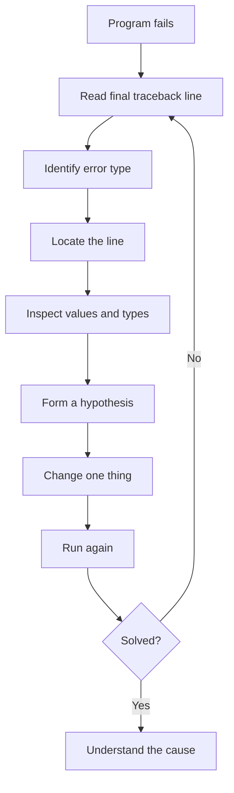

> An error does not only say that something failed: it gives evidence about the program's state.

---

## 15. Session concept map

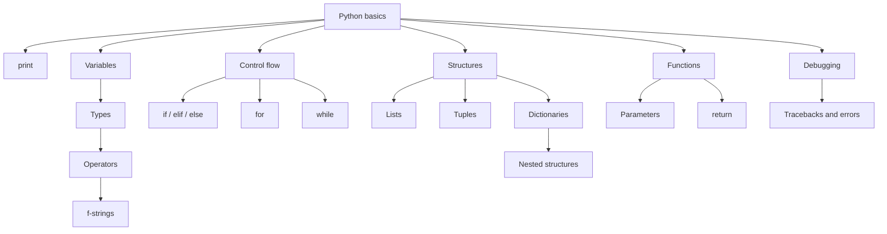

---

## 16. Quick reference sheet

```python
# Display
print("Hello")

# Variables
age = 30
name = "Ana"

# Type
type(age)

# f-string
print(f"{name} is {age} years old")

# Decision
if age >= 18:
    print("Adult")
else:
    print("Minor")

# for
for number in range(5):
    print(number)

# while
balance = 3
while balance > 0:
    balance -= 1

# List
products = ["Coffee", "Bread"]
products.append("Milk")

# Tuple
product = ("Coffee", 3500)

# Dictionary
prices = {"Coffee": 3500}
price = prices.get("Coffee", 0)

# Function
def double(number):
    return number * 2
```

---

## 17. Check your understanding

### Level 1 — Recognize and apply

1. Why do `30` and `"30"` behave differently?
2. What is the difference between `=` and `==`?
3. Why does Python require indentation inside an `if`?
4. When would you use `for`, and when would you use `while`?

### Level 2 — Compare

1. What practical difference exists between a list and a tuple?
2. Why can a dictionary model some data better than a list?
3. Why can `.get()` be safer than `dictionary[key]`?
4. What functional difference exists between `print()` and `return`?

### Level 3 — Design

Imagine a store with categories and products.

```text
store
│
├── Beverages
│   ├── ("Coffee", 3500)
│   └── ("Juice", 5000)
│
└── Bakery
    ├── ("Bread", 1200)
    └── ("Croissant", 4500)
```

Think about which combination of:

- dictionary;
- lists;
- tuples;
- loops;
- conditionals;
- functions;

you would use to calculate average prices, apply discounts, and classify products.

---

## 18. Reinforcement exercises

### 🟢 Exercise 1

Create a list of five prices and calculate:

- total;
- average;
- maximum;
- minimum.

Hints:

```python
sum()
len()
max()
min()
```

### 🟡 Exercise 2

Write a function:

```python
count_even(numbers)
```

that returns how many even numbers are contained in a list.

Remember:

```python
number % 2 == 0
```

### 🔴 Exercise 3

Given a dictionary of categories containing products and prices, build:

```python
most_expensive_category()
```

that returns the category with the highest average price.

---

## 19. What you should be able to explain at the end

- what a variable is and how it relates to a data type;
- why a type affects the operations that are available;
- how a condition lets a program choose a path;
- how `for` and `while` support repetition;
- how lists, tuples, and dictionaries represent information differently;
- how structures can be combined to model more complex data;
- why functions make solutions reusable;
- why `return` and `print()` are not equivalent;
- how to use a traceback as a source of information;
- the conceptual difference between working in a notebook and in a `.py` file.

---

## Next session

The next session moves these ideas toward **NumPy** and numerical computing: representing the same data with structures designed for more efficient numerical operations.

```text
Python basics
     │
     ▼
lists and structures
     │
     ▼
NumPy arrays
     │
     ▼
numerical operations on data
```
