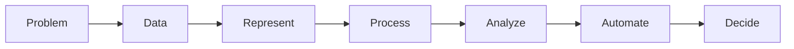
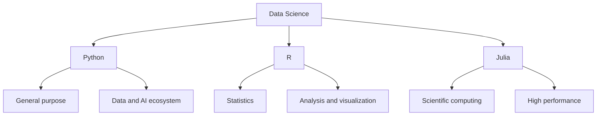
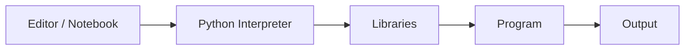
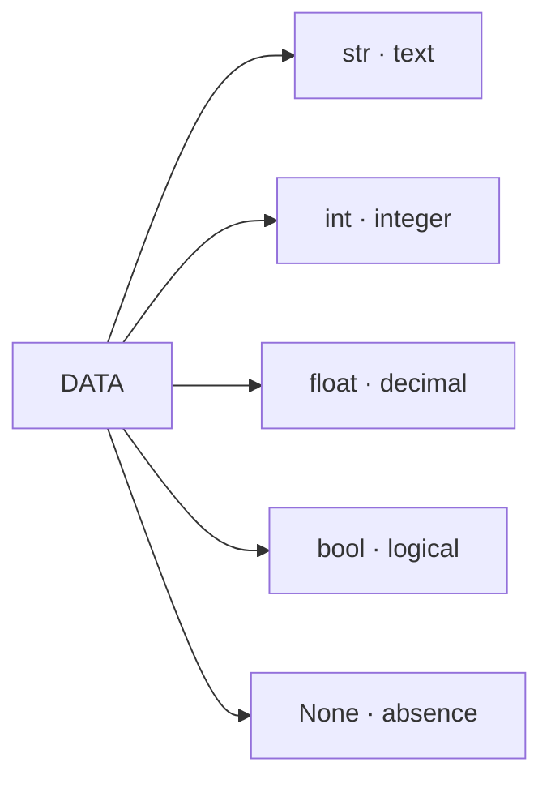
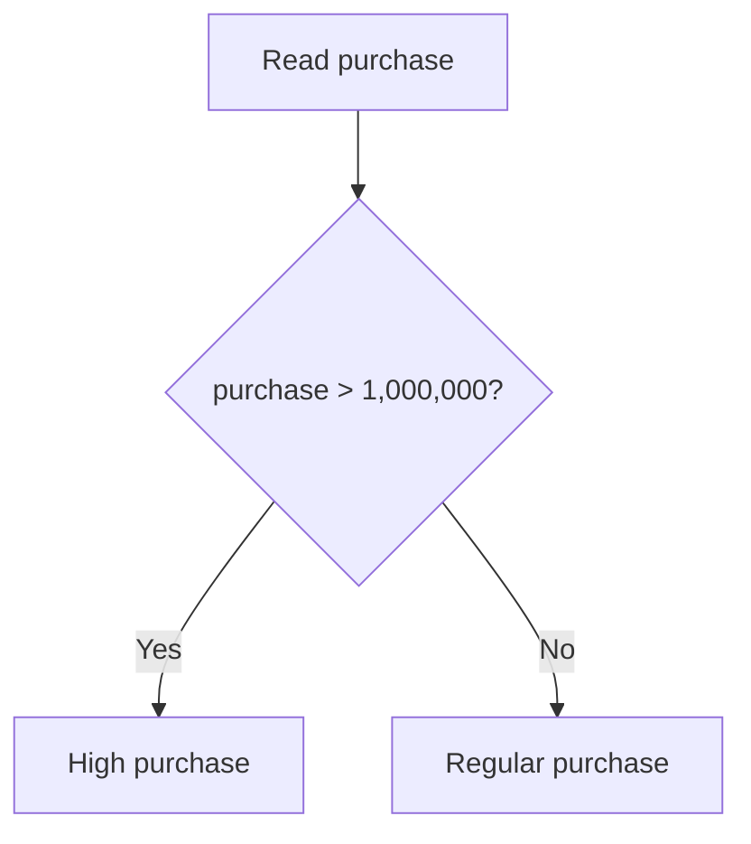
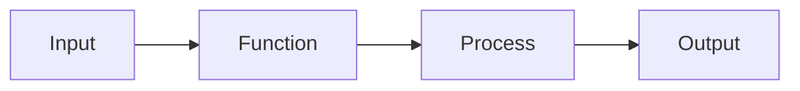
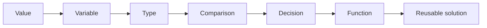
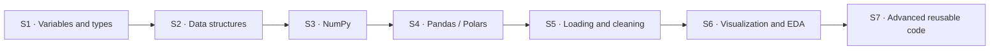

# Session 1 · Programming for Data Science: First Steps with Python

> **Core idea:** in Data Science, we do not program just for the sake of programming. We write code to represent data, answer questions, automate processes, and build reproducible solutions.

<div class="callout callout-primary" markdown="1">

## 🎯 By the end of this session, you will be able to

- explain why programming is used within a Data Science workflow;
- distinguish, at a general level, the roles of **Python, R, and Julia**;
- recognize the basic components of a development environment;
- represent information using Python variables and data types;
- use operators and simple decisions to solve a problem;
- interpret basic errors as useful debugging information;
- move from a direct solution toward a more general and reusable solution.

</div>

---

## 1. Why program in Data Science?

Imagine we receive this small dataset:

| customer | age | city | purchase | active |
|---|---:|---|---:|:---:|
| Laura | 31 | Tunja | 520000 | ✅ |
| Carlos | 45 | Bogotá | 1250000 | ❌ |
| Ana | 27 | Tunja | 890000 | ✅ |

With three rows, we can answer many questions by simply looking at the table. Now imagine receiving **millions of records every day**.

We may want to answer questions such as:

- which customers purchased more than $1,000,000?;
- which city generates the highest sales?;
- what is the average purchase value?;
- are there missing or inconsistent values?;
- can we repeat the analysis tomorrow without doing everything manually again?

Programming turns these questions into processes that a computer can execute.



### Three essential concepts

| Concept | Idea |
|---|---|
| **Algorithm** | An ordered sequence of steps used to solve a problem. |
| **Code** | A representation of those steps using a programming language. |
| **Program** | A set of instructions a computer can execute to perform a task. |

<div class="terminal-card" markdown="1">

```text
PROBLEM
  ↓
"I need to identify high-value purchases"
  ↓
ALGORITHM
  ↓
1. Read the purchase value
2. Compare it with a threshold
3. Classify it
  ↓
CODE
  ↓
The computer executes the decision
```

</div>

### Programming is not memorizing commands

In Data Science, programming mainly involves:

1. **understanding the problem**;
2. **representing the data** appropriately;
3. **defining transformations and rules**;
4. **evaluating the result**;
5. **making the solution repeatable**.

---

## 2. Python, R, and Julia

Many programming languages can work with data. In Data Science, **Python, R, and Julia** are common choices.



| Language | General strengths | Common use |
|---|---|---|
| **Python** | Readable syntax, general purpose, broad ecosystem | Data manipulation, automation, ML, AI, applications |
| **R** | Mature statistical ecosystem | Statistics, research, analysis, visualization |
| **Julia** | Designed for scientific and high-performance computing | Numerical computing, simulation, scientific research |

### Why Python?

Python can participate in multiple stages of a project:

```text
Data → Cleaning → Analysis → Visualization → Machine Learning → Automation
             └──────────────── Python can support all of them ────────────────┘
```

Throughout the course, you will encounter specialized libraries such as **NumPy, Pandas, Polars, Matplotlib, Seaborn, and Plotly**. In this first session, the goal is to understand the language they build upon.

---

## 3. The development environment

Running code requires more than typing text. A development environment combines several components.



### Main components

| Component | Purpose |
|---|---|
| **Editor** | Where code is written. |
| **Interpreter** | Executes instructions written in Python. |
| **Notebook** | Combines code, text, output, and visualizations in cells. |
| **Library** | Reusable code designed to solve specific tasks. |
| **Environment** | A controlled set of Python and dependency versions for a project. |

### Script, Notebook, and IDE

<div class="three-grid" markdown="1">

<div class="mini-card" markdown="1">

### 📄 Script

```text
analysis.py
```

An executable code file. It is useful for reproducible processes and automation.

</div>

<div class="mini-card" markdown="1">

### 📓 Notebook

```text
Cell 1 → code
Cell 2 → output
Cell 3 → text
Cell 4 → chart
```

Very useful for exploration, experimentation, and communicating analyses.

</div>

<div class="mini-card" markdown="1">

### 🧰 IDE / Advanced editor

Combines editing, navigation, terminal access, extensions, and debugging tools.

</div>

</div>

### Conceptual project anatomy

```text
my-data-project/
├── data/          ← data
├── notebooks/     ← exploration
├── src/           ← reusable code
├── outputs/       ← results
└── README.md      ← documentation
```

Not every project starts with this structure, but separating **data, exploration, code, and outputs** helps keep work organized.

---

## 4. Your first contact with Python

### 4.1. Execute an instruction

```python
print("Hello, Data Science!")
```

`print()` displays information in the output.

```text
┌────────────────────────┐
│ Hello, Data Science!    │
└────────────────────────┘
```

### 4.2. Variables

A variable associates a name with a value.

```python
customer = "Laura"
age = 31
purchase = 520000.0
active = True
```

Visually:

```text
┌──────────┐      ┌────────────┐
│ customer │ ───▶ │ "Laura"    │
└──────────┘      └────────────┘

┌──────────┐      ┌────────────┐
│ age      │ ───▶ │ 31         │
└──────────┘      └────────────┘

┌──────────┐      ┌────────────┐
│ purchase │ ───▶ │ 520000.0   │
└──────────┘      └────────────┘
```

The `=` symbol performs an **assignment**: the name on the left references the value on the right.

### Practical naming rules

```python
customer_name = "Laura"      # valid
purchase_total = 520000      # valid
```

Avoid meaningless names:

```python
x = "Laura"
y = 520000
```

As programs grow, descriptive names reduce ambiguity.

---

## 5. Basic data types

A type describes the nature of a value and determines which operations make sense for it.

| Type | Example | Represents |
|---|---|---|
| `str` | `"Tunja"` | Text |
| `int` | `31` | Integer number |
| `float` | `520000.0` | Decimal number |
| `bool` | `True` | True/false logical value |
| `NoneType` | `None` | Absence of a value |

### Visual map



### Inspect a type with `type()`

```python
customer = "Laura"
age = 31
purchase = 520000.0
active = True

print(type(customer))
print(type(age))
print(type(purchase))
print(type(active))
```

A possible output is:

```text
<class 'str'>
<class 'int'>
<class 'float'>
<class 'bool'>
```

### Values can look similar and still be different

```python
age_number = 31
age_text = "31"
```

```text
31      → number → numeric operations make sense
"31"    → text   → represents characters
```

```python
print(age_number + 5)
```

```text
36
```

But:

```python
print(age_text + 5)
```

produces an error because the program attempts to combine text and a number using an invalid operation.

---

## 6. Operators: transform and compare

Operators allow us to build expressions.

### 6.1. Arithmetic operators

| Operator | Operation | Example |
|:---:|---|---|
| `+` | addition | `10 + 5` |
| `-` | subtraction | `10 - 5` |
| `*` | multiplication | `10 * 5` |
| `/` | division | `10 / 5` |
| `//` | floor division | `11 // 5` |
| `%` | remainder | `11 % 5` |
| `**` | exponentiation | `2 ** 3` |

### 6.2. Comparison operators

A comparison produces `True` or `False`.

```python
purchase = 1250000

print(purchase > 1000000)
print(purchase == 1250000)
print(purchase < 500000)
```

```text
True
True
False
```

| Operator | Meaning |
|:---:|---|
| `>` | greater than |
| `<` | less than |
| `>=` | greater than or equal to |
| `<=` | less than or equal to |
| `==` | equal to |
| `!=` | not equal to |

<div class="callout callout-warning" markdown="1">

### `=` is not the same as `==`

```python
purchase = 520000       # assignment
purchase == 520000      # comparison
```

</div>

---

## 7. Make decisions with `if`

Many data problems involve rules.

> If a purchase exceeds $1,000,000, classify it as a high-value purchase.

The logic can be represented before writing code:



In Python:

```python
purchase = 1250000

if purchase > 1000000:
    print("High purchase")
else:
    print("Regular purchase")
```

### More than two possibilities

```python
purchase = 750000

if purchase < 500000:
    category = "Low"
elif purchase <= 1000000:
    category = "Medium"
else:
    category = "High"

print(category)
```

```text
Medium
```

### Indentation matters

Python uses indentation to determine which instructions belong to a block.

```python
if purchase > 1000000:
    print("High purchase")
    print("Review this transaction")
```

Both indented instructions belong to the `if` block.

---

## 8. Functions: turn a solution into something reusable

If we need to classify hundreds or thousands of purchases, copying the same block again and again is not a good strategy.

A function encapsulates a reusable operation.



### Example

```python
def classify_purchase(value):
    if value < 500000:
        return "Low"
    elif value <= 1000000:
        return "Medium"
    else:
        return "High"
```

Now we can reuse it:

```python
print(classify_purchase(350000))
print(classify_purchase(750000))
print(classify_purchase(1250000))
```

```text
Low
Medium
High
```

### Function anatomy

```text
def classify_purchase(value):
│   │                 │
│   │                 └── parameter / input
│   └──────────────────── function name
└──────────────────────── defines a function

return "High"
  └────────── value returned by the function
```

The key idea is not memorizing `def`. The key idea is moving from:

```text
"solve this case"
```

to:

```text
"build a solution that can be reused"
```

---

## 9. Errors also contain information

In programming, an error does not automatically mean the whole idea is wrong. It often indicates a mismatch between what the code **expects** and what it actually **received**.

### Example

```python
age = "31"
print(age + 5)
```

A shortened error message may look like this:

```text
TypeError
can only concatenate str ...
```

We can read it as a clue:

```text
ERROR
  │
  ├── Where did it happen?
  ├── Which operation did I attempt?
  ├── Which values were involved?
  └── What types did those values have?
```

### Three useful categories

| Problem type | What happens | Example |
|---|---|---|
| **Syntax** | The code does not follow the language structure | missing `:` after an `if` |
| **Runtime** | The code starts, but an operation fails | adding `str` + `int` |
| **Logic** | The program runs but produces an incorrect result | using the wrong threshold |

<div class="callout callout-success" markdown="1">

### Initial debugging strategy

```text
1. Read the message
2. Identify the line
3. Inspect the values
4. Check their types
5. Change one thing
6. Run again
```

</div>

---

## 10. Progressive challenge: one concept, different depths

The challenges are organized so you can keep going deeper after completing a level.

```text
🟢 Level 1 ──▶ 🟡 Level 2 ──▶ 🔴 Level 3
    apply            adapt           generalize
```

### 🟢 Level 1 · Represent a transaction

Create variables to represent:

```text
customer
age
city
purchase
active
```

Display the value and type of each variable.

<details>
<summary>💡 Hint</summary>

You can combine `print()` and `type()`.

```python
print(customer, type(customer))
```

</details>

<details>
<summary>✅ One possible solution</summary>

```python
customer = "Laura"
age = 31
city = "Tunja"
purchase = 520000.0
active = True

print(customer, type(customer))
print(age, type(age))
print(city, type(city))
print(purchase, type(purchase))
print(active, type(active))
```

</details>

---

### 🟡 Level 2 · Classify a purchase

Build a solution that classifies a value using these rules:

```text
purchase < 500000             → Low
500000 <= purchase <= 1000000 → Medium
purchase > 1000000            → High
```

<details>
<summary>💡 Hint</summary>

Think about `if`, `elif`, and `else`.

</details>

<details>
<summary>✅ One possible solution</summary>

```python
purchase = 750000

if purchase < 500000:
    category = "Low"
elif purchase <= 1000000:
    category = "Medium"
else:
    category = "High"

print(category)
```

</details>

---

### 🔴 Level 3 · Generalize the solution

Turn the previous classification into a reusable function.

Requirements:

- receive one value as input;
- return `Low`, `Medium`, or `High`;
- work with different purchase values without rewriting the entire logic.

<details>
<summary>💡 Hint</summary>

The structure can begin like this:

```python
def classify_purchase(value):
    ...
```

</details>

<details>
<summary>✅ One possible solution</summary>

```python
def classify_purchase(value):
    if value < 500000:
        return "Low"
    elif value <= 1000000:
        return "Medium"
    else:
        return "High"

print(classify_purchase(350000))
print(classify_purchase(750000))
print(classify_purchase(1250000))
```

</details>

---

### 🔴+ Extension · Make it more robust

What should happen if we receive this?

```python
classify_purchase(None)
classify_purchase("750000")
classify_purchase(-50)
```

Think before coding:

```text
Which inputs do I consider valid?
        ↓
How do I detect invalid input?
        ↓
What should my function return?
```

There is not always a single correct design choice. What matters is that the rule is explicit and consistent.

---

## 11. From a one-off solution to a reusable solution

Observe the progression:



Programming knowledge often grows like this:

```text
RECOGNIZE
"I understand what it does"
    ↓
APPLY
"I can repeat it"
    ↓
ADAPT
"I can change it"
    ↓
GENERALIZE
"I can turn it into a reusable solution"
```

---

## 12. Questions for discussing solutions

When two programs produce the same output, we can still compare them.

- What assumptions does each solution make?
- What happens with unexpected inputs?
- How easy would it be to reuse?
- How easy is it to understand one week later?
- Which part is specific to one case, and which part is general?
- What changes if we have 10 records? What about 10 million?

> **Code that works** and **well-designed code** do not always mean the same thing.

---

## 13. Session cheat sheet

```python
# Display a value
print("Data Science")

# Variables
customer = "Laura"
age = 31
purchase = 520000.0
active = True

# Inspect a type
type(customer)
type(age)

# Comparisons
purchase > 1000000
purchase == 520000
purchase != 0

# Decisions
if purchase < 500000:
    category = "Low"
elif purchase <= 1000000:
    category = "Medium"
else:
    category = "High"

# Function
def classify_purchase(value):
    if value < 500000:
        return "Low"
    elif value <= 1000000:
        return "Medium"
    return "High"
```

---

## 14. Quick self-assessment

Choose the description that best matches your current state:

<div class="level-grid" markdown="1">

<div class="level-card level-green" markdown="1">

### 🟢 Foundation

I can create variables, recognize their types, and execute examples with support.

</div>

<div class="level-card level-yellow" markdown="1">

### 🟡 Application

I can use conditions to solve a similar problem independently.

</div>

<div class="level-card level-red" markdown="1">

### 🔴 Deepening

I can generalize logic into functions and think about unexpected cases.

</div>

</div>

### Check your understanding

1. Why are `31` and `"31"` not equivalent in Python?
2. What is the difference between `=` and `==`?
3. Why does a function improve code reuse?
4. What information would you inspect first after finding a `TypeError`?
5. Which part of a Data Science problem happens before writing code?

<details>
<summary>View short answers</summary>

1. Because they have different types: `int` and `str`.
2. `=` assigns; `==` compares.
3. It encapsulates an operation so it can be executed with different inputs.
4. The error line, the attempted operation, and the types of the values involved.
5. Understanding the question, the data, and the logic required to solve it.

</details>

---

## 15. How this session connects to the rest of the course

What appears today as individual values will progressively grow:



```text
TODAY
one value
  ↓
list / dictionary
  ↓
array
  ↓
DataFrame
  ↓
real dataset
  ↓
analysis
  ↓
reusable solution
```

---

## 16. Recommended references

- VanderPlas, J. (2022). *Python Data Science Handbook: Essential Tools for Working with Data* (2nd ed.).
- McKinney, W. (2022). *Python for Data Analysis: Data Wrangling with pandas, NumPy, and Jupyter* (3rd ed.).
- Guttag, J. V. (2021). *Introduction to Computation and Programming Using Python: With Application to Computational Modeling and Understanding Data* (3rd ed.).
- Vohra, M. (2021). *Jupyter for Data Science: Exploratory Analysis, Statistical Modeling, Machine Learning, and Data Visualization*.

---

<div class="final-banner" markdown="1">

## 🧠 Key idea to take away

```text
I do not need to know all of Python to begin.
I need to understand the problem,
represent the data,
test an idea,
read the result,
and improve the solution.
```

</div>
