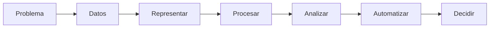
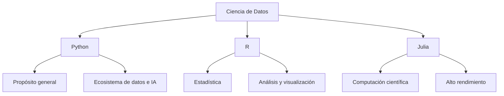
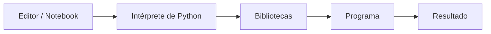
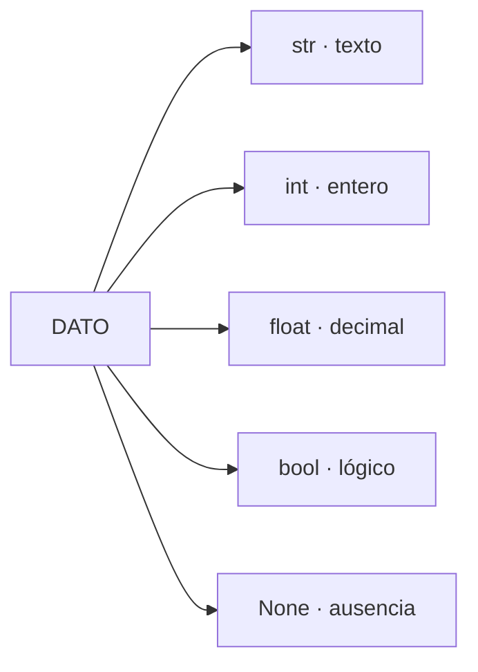
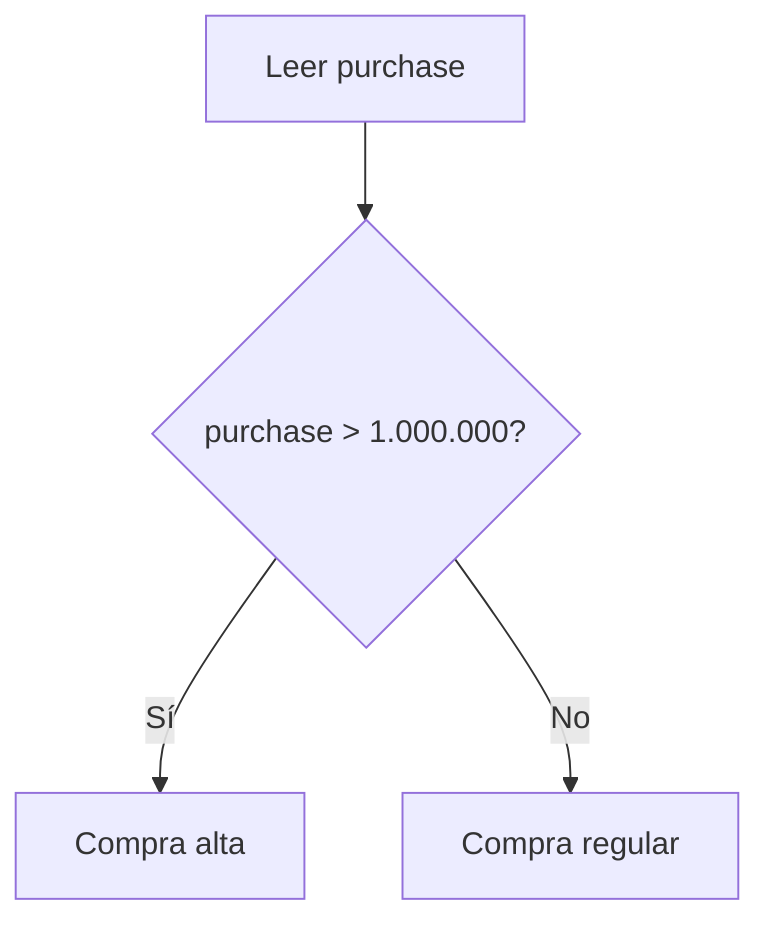
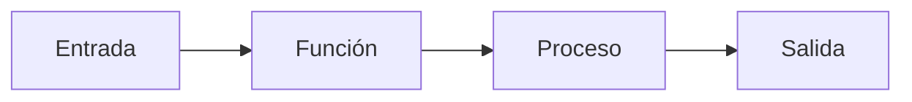
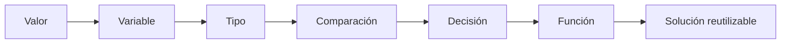
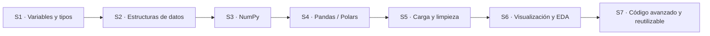

# Sesión 1 · Programación para Data Science: primer contacto con Python

> **Idea central:** en Ciencia de Datos no programamos por programar. Escribimos código para representar datos, responder preguntas, automatizar procesos y construir soluciones reproducibles.

<div class="callout callout-primary" markdown="1">

## 🎯 Al finalizar esta sesión podrás

- explicar para qué se utiliza la programación dentro de un flujo de Ciencia de Datos;
- distinguir, a nivel general, el papel de **Python, R y Julia**;
- reconocer los componentes básicos de un ambiente de desarrollo;
- representar información mediante variables y tipos de datos de Python;
- utilizar operadores y decisiones simples para resolver un problema;
- interpretar errores básicos como información útil para depurar código;
- avanzar desde una solución directa hacia una solución más general y reutilizable.

</div>

---

## 1. ¿Por qué programar en Ciencia de Datos?

Imagina que recibimos este pequeño conjunto de datos:

| customer | age | city | purchase | active |
|---|---:|---|---:|:---:|
| Laura | 31 | Tunja | 520000 | ✅ |
| Carlos | 45 | Bogotá | 1250000 | ❌ |
| Ana | 27 | Tunja | 890000 | ✅ |

Con tres filas podemos responder muchas preguntas mirando la tabla. Pero ahora imagina que llegan **millones de registros cada día**.

Queremos responder preguntas como:

- ¿qué clientes compraron más de $1.000.000?;
- ¿qué ciudad genera mayores ventas?;
- ¿cuál es el valor promedio de compra?;
- ¿hay datos incompletos o inconsistentes?;
- ¿podemos repetir el análisis mañana sin hacerlo manualmente otra vez?

La programación convierte estas preguntas en procesos que una computadora puede ejecutar.



### Tres conceptos esenciales

| Concepto | Idea |
|---|---|
| **Algoritmo** | Secuencia ordenada de pasos para resolver un problema. |
| **Código** | Representación de esos pasos utilizando un lenguaje de programación. |
| **Programa** | Conjunto de instrucciones que una computadora puede ejecutar para realizar una tarea. |

<div class="terminal-card" markdown="1">

```text
PROBLEMA
  ↓
"Necesito identificar compras altas"
  ↓
ALGORITMO
  ↓
1. Leer el valor de compra
2. Compararlo con un umbral
3. Clasificarlo
  ↓
CÓDIGO
  ↓
La computadora ejecuta la decisión
```

</div>

### Programar no es memorizar comandos

En Ciencia de Datos, programar implica principalmente:

1. **entender el problema**;
2. **representar los datos** de forma adecuada;
3. **definir transformaciones y reglas**;
4. **evaluar el resultado**;
5. **hacer que la solución pueda repetirse**.

---

## 2. Python, R y Julia

Existen muchos lenguajes capaces de trabajar con datos. En Ciencia de Datos aparecen con frecuencia **Python, R y Julia**.



| Lenguaje | Fortalezas generales | Uso frecuente |
|---|---|---|
| **Python** | Sintaxis legible, propósito general, gran ecosistema | Manipulación de datos, automatización, ML, IA, aplicaciones |
| **R** | Ecosistema estadístico muy consolidado | Estadística, investigación, análisis y visualización |
| **Julia** | Orientado al cálculo científico y alto rendimiento | Computación numérica, simulación, investigación científica |

### ¿Por qué Python?

Python permite utilizar el mismo lenguaje para diferentes etapas de un proyecto:

```text
Datos → Limpieza → Análisis → Visualización → Machine Learning → Automatización
             └────────────── Python puede participar en todas ──────────────┘
```

A lo largo del curso aparecerán bibliotecas especializadas como **NumPy, Pandas, Polars, Matplotlib, Seaborn y Plotly**. En esta primera sesión el objetivo es comprender el lenguaje sobre el que se apoyan.

---

## 3. El ambiente de desarrollo

Para ejecutar código necesitamos más que escribir texto. Un ambiente de desarrollo reúne diferentes componentes.



### Componentes principales

| Componente | Función |
|---|---|
| **Editor** | Lugar donde escribimos código. |
| **Intérprete** | Ejecuta las instrucciones escritas en Python. |
| **Notebook** | Combina código, texto, resultados y visualizaciones en celdas. |
| **Biblioteca** | Código reutilizable creado para resolver tareas específicas. |
| **Entorno** | Conjunto controlado de versión de Python y dependencias de un proyecto. |

### Script, Notebook e IDE

<div class="three-grid" markdown="1">

<div class="mini-card" markdown="1">

### 📄 Script

```text
analysis.py
```

Archivo de código ejecutable. Es apropiado para procesos reproducibles y automatización.

</div>

<div class="mini-card" markdown="1">

### 📓 Notebook

```text
Celda 1 → código
Celda 2 → resultado
Celda 3 → texto
Celda 4 → gráfico
```

Muy útil para exploración, experimentación y comunicación de análisis.

</div>

<div class="mini-card" markdown="1">

### 🧰 IDE / Editor avanzado

Integra edición, navegación, terminal, extensiones y herramientas de depuración.

</div>

</div>

### Anatomía conceptual de un proyecto

```text
my-data-project/
├── data/          ← datos
├── notebooks/     ← exploración
├── src/           ← código reutilizable
├── outputs/       ← resultados
└── README.md      ← documentación
```

No todos los proyectos comienzan con esta estructura, pero separar **datos, exploración, código y resultados** ayuda a mantener el trabajo organizado.

---

## 4. Tu primer contacto con Python

### 4.1. Ejecutar una instrucción

```python
print("Hello, Data Science!")
```

`print()` muestra información en la salida.

```text
┌────────────────────────┐
│ Hello, Data Science!    │
└────────────────────────┘
```

### 4.2. Variables

Una variable asocia un nombre con un valor.

```python
customer = "Laura"
age = 31
purchase = 520000.0
active = True
```

Visualmente:

```text
┌──────────┐      ┌────────────┐
│ customer │ ───▶ │ "Laura"    │
└──────────┘      └────────────┘

┌──────────┐      ┌────────────┐
│ age      │ ───▶ │ 31         │
└──────────┘      └────────────┘

┌──────────┐      ┌────────────┐
│ purchase │ ───▶ │ 520000.0   │
└──────────┘      └────────────┘
```

El símbolo `=` realiza una **asignación**: el nombre de la izquierda referencia el valor de la derecha.

### Reglas prácticas para nombres

```python
customer_name = "Laura"      # válido
purchase_total = 520000      # válido
```

Evita nombres sin significado:

```python
x = "Laura"
y = 520000
```

Cuando el programa crece, nombres descriptivos reducen ambigüedad.

---

## 5. Tipos de datos básicos

El tipo describe la naturaleza de un valor y determina qué operaciones tienen sentido sobre él.

| Tipo | Ejemplo | Representa |
|---|---|---|
| `str` | `"Tunja"` | Texto |
| `int` | `31` | Número entero |
| `float` | `520000.0` | Número con parte decimal |
| `bool` | `True` | Valor lógico verdadero/falso |
| `NoneType` | `None` | Ausencia de valor |

### Mapa visual



### Consultar el tipo con `type()`

```python
customer = "Laura"
age = 31
purchase = 520000.0
active = True

print(type(customer))
print(type(age))
print(type(purchase))
print(type(active))
```

Una salida posible es:

```text
<class 'str'>
<class 'int'>
<class 'float'>
<class 'bool'>
```

### El valor puede parecer igual y ser distinto

```python
age_number = 31
age_text = "31"
```

```text
31      → número → puede sumarse numéricamente
"31"    → texto  → representa caracteres
```

```python
print(age_number + 5)
```

```text
36
```

Pero:

```python
print(age_text + 5)
```

produce un error porque se intenta combinar texto y número mediante una operación no válida.

---

## 6. Operadores: transformar y comparar

Los operadores permiten construir expresiones.

### 6.1. Operadores aritméticos

| Operador | Operación | Ejemplo |
|:---:|---|---|
| `+` | suma | `10 + 5` |
| `-` | resta | `10 - 5` |
| `*` | multiplicación | `10 * 5` |
| `/` | división | `10 / 5` |
| `//` | división entera | `11 // 5` |
| `%` | residuo | `11 % 5` |
| `**` | potencia | `2 ** 3` |

### 6.2. Operadores de comparación

Una comparación produce `True` o `False`.

```python
purchase = 1250000

print(purchase > 1000000)
print(purchase == 1250000)
print(purchase < 500000)
```

```text
True
True
False
```

| Operador | Significado |
|:---:|---|
| `>` | mayor que |
| `<` | menor que |
| `>=` | mayor o igual |
| `<=` | menor o igual |
| `==` | igual a |
| `!=` | diferente de |

<div class="callout callout-warning" markdown="1">

### `=` no es lo mismo que `==`

```python
purchase = 520000       # asignación
purchase == 520000      # comparación
```

</div>

---

## 7. Tomar decisiones con `if`

Muchos problemas de datos incluyen reglas.

> Si una compra supera $1.000.000, clasificarla como compra alta.

La lógica puede representarse antes de escribir código:



En Python:

```python
purchase = 1250000

if purchase > 1000000:
    print("High purchase")
else:
    print("Regular purchase")
```

### Más de dos posibilidades

```python
purchase = 750000

if purchase < 500000:
    category = "Low"
elif purchase <= 1000000:
    category = "Medium"
else:
    category = "High"

print(category)
```

```text
Medium
```

### La indentación importa

Python utiliza la indentación para indicar qué instrucciones pertenecen a un bloque.

```python
if purchase > 1000000:
    print("High purchase")
    print("Review this transaction")
```

Las dos instrucciones indentadas pertenecen al `if`.

---

## 8. Funciones: convertir una solución en algo reutilizable

Si necesitamos clasificar cientos o miles de compras, copiar el mismo bloque una y otra vez no es una buena estrategia.

Una función encapsula una operación reutilizable.



### Ejemplo

```python
def classify_purchase(value):
    if value < 500000:
        return "Low"
    elif value <= 1000000:
        return "Medium"
    else:
        return "High"
```

Ahora podemos reutilizarla:

```python
print(classify_purchase(350000))
print(classify_purchase(750000))
print(classify_purchase(1250000))
```

```text
Low
Medium
High
```

### Anatomía de una función

```text
def classify_purchase(value):
│   │                 │
│   │                 └── parámetro / entrada
│   └──────────────────── nombre de la función
└──────────────────────── define una función

return "High"
  └────────── valor que la función devuelve
```

La idea importante no es memorizar `def`. La idea es pasar de:

```text
"resolver este caso"
```

a:

```text
"construir una solución que pueda volver a usarse"
```

---

## 9. El error también contiene información

En programación, un error no significa automáticamente que la idea completa sea incorrecta. Muchas veces indica que existe una diferencia entre lo que el código **espera** y lo que realmente **recibió**.

### Ejemplo

```python
age = "31"
print(age + 5)
```

Una versión resumida del mensaje puede verse así:

```text
TypeError
can only concatenate str ...
```

Podemos leerlo como una pista:

```text
ERROR
  │
  ├── ¿Dónde ocurrió?
  ├── ¿Qué operación intenté realizar?
  ├── ¿Qué valores participaron?
  └── ¿Qué tipos tenían esos valores?
```

### Tres categorías útiles

| Tipo de problema | Qué ocurre | Ejemplo |
|---|---|---|
| **Sintaxis** | El código no respeta la estructura del lenguaje | falta `:` después de un `if` |
| **Ejecución** | El código comienza, pero una operación falla | sumar `str` + `int` |
| **Lógica** | El programa corre, pero produce un resultado incorrecto | usar un umbral equivocado |

<div class="callout callout-success" markdown="1">

### Estrategia de depuración inicial

```text
1. Leer el mensaje
2. Identificar la línea
3. Revisar los valores
4. Consultar sus tipos
5. Cambiar una cosa
6. Ejecutar de nuevo
```

</div>

---

## 10. Reto progresivo: un mismo concepto, diferentes profundidades

Los retos están organizados para que puedas continuar profundizando cuando completes un nivel.

```text
🟢 Nivel 1 ──▶ 🟡 Nivel 2 ──▶ 🔴 Nivel 3
   aplicar         adaptar         generalizar
```

### 🟢 Nivel 1 · Representar una transacción

Crea variables para representar:

```text
customer
age
city
purchase
active
```

Muestra el valor y el tipo de cada variable.

<details>
<summary>💡 Pista</summary>

Puedes combinar `print()` y `type()`.

```python
print(customer, type(customer))
```

</details>

<details>
<summary>✅ Una posible solución</summary>

```python
customer = "Laura"
age = 31
city = "Tunja"
purchase = 520000.0
active = True

print(customer, type(customer))
print(age, type(age))
print(city, type(city))
print(purchase, type(purchase))
print(active, type(active))
```

</details>

---

### 🟡 Nivel 2 · Clasificar una compra

Construye una solución que clasifique un valor con estas reglas:

```text
purchase < 500000             → Low
500000 <= purchase <= 1000000 → Medium
purchase > 1000000            → High
```

<details>
<summary>💡 Pista</summary>

Piensa en `if`, `elif` y `else`.

</details>

<details>
<summary>✅ Una posible solución</summary>

```python
purchase = 750000

if purchase < 500000:
    category = "Low"
elif purchase <= 1000000:
    category = "Medium"
else:
    category = "High"

print(category)
```

</details>

---

### 🔴 Nivel 3 · Generalizar la solución

Convierte la clasificación anterior en una función reutilizable.

Requisitos:

- recibe un valor como entrada;
- devuelve `Low`, `Medium` o `High`;
- puede utilizarse con diferentes compras sin reescribir toda la lógica.

<details>
<summary>💡 Pista</summary>

La estructura puede comenzar así:

```python
def classify_purchase(value):
    ...
```

</details>

<details>
<summary>✅ Una posible solución</summary>

```python
def classify_purchase(value):
    if value < 500000:
        return "Low"
    elif value <= 1000000:
        return "Medium"
    else:
        return "High"

print(classify_purchase(350000))
print(classify_purchase(750000))
print(classify_purchase(1250000))
```

</details>

---

### 🔴+ Extensión · Hacerla más robusta

¿Qué debería ocurrir si recibimos esto?

```python
classify_purchase(None)
classify_purchase("750000")
classify_purchase(-50)
```

Piensa antes de programar:

```text
¿Qué entradas considero válidas?
        ↓
¿Cómo detecto una entrada inválida?
        ↓
¿Qué debería devolver mi función?
```

No existe una única decisión correcta: importa que la regla sea explícita y consistente.

---

## 11. De una solución puntual a una solución reutilizable

Observa la progresión:



El aprendizaje de programación suele crecer de esta manera:

```text
RECONOCER
"entiendo qué hace"
    ↓
APLICAR
"puedo repetirlo"
    ↓
ADAPTAR
"puedo cambiarlo"
    ↓
GENERALIZAR
"puedo convertirlo en una solución reutilizable"
```

---

## 12. Preguntas para discutir soluciones

Cuando dos programas producen el mismo resultado, todavía podemos compararlos.

- ¿Qué supuestos hace cada solución?
- ¿Qué ocurre con entradas inesperadas?
- ¿Qué tan fácil sería reutilizarla?
- ¿Qué tan sencillo es entenderla al volver a verla una semana después?
- ¿Qué parte está escrita específicamente para un caso y cuál es general?
- ¿Qué cambiaría si tuviéramos 10 registros? ¿Y 10 millones?

> **Código que funciona** y **código bien diseñado** no siempre significan lo mismo.

---

## 13. Cheat sheet de la sesión

```python
# Mostrar un valor
print("Data Science")

# Variables
customer = "Laura"
age = 31
purchase = 520000.0
active = True

# Consultar un tipo
type(customer)
type(age)

# Comparaciones
purchase > 1000000
purchase == 520000
purchase != 0

# Decisiones
if purchase < 500000:
    category = "Low"
elif purchase <= 1000000:
    category = "Medium"
else:
    category = "High"

# Función
def classify_purchase(value):
    if value < 500000:
        return "Low"
    elif value <= 1000000:
        return "Medium"
    return "High"
```

---

## 14. Autoevaluación rápida

Marca mentalmente cuál descripción se parece más a tu estado actual:

<div class="level-grid" markdown="1">

<div class="level-card level-green" markdown="1">

### 🟢 Base

Puedo crear variables, reconocer sus tipos y ejecutar ejemplos con apoyo.

</div>

<div class="level-card level-yellow" markdown="1">

### 🟡 Aplicación

Puedo utilizar condiciones para resolver un problema parecido por mi cuenta.

</div>

<div class="level-card level-red" markdown="1">

### 🔴 Profundización

Puedo generalizar la lógica en funciones y pensar en casos inesperados.

</div>

</div>

### Comprueba tu comprensión

1. ¿Por qué `31` y `"31"` no son equivalentes para Python?
2. ¿Qué diferencia existe entre `=` y `==`?
3. ¿Por qué una función mejora la reutilización del código?
4. ¿Qué información buscarías primero al encontrar un `TypeError`?
5. ¿Qué parte de un problema de Ciencia de Datos ocurre antes de escribir código?

<details>
<summary>Ver respuestas breves</summary>

1. Porque tienen tipos distintos: `int` y `str`.
2. `=` asigna; `==` compara.
3. Encapsula una operación para ejecutarla con diferentes entradas.
4. La línea del error, la operación y los tipos de los valores involucrados.
5. Comprender la pregunta, los datos y la lógica necesaria para resolverla.

</details>

---

## 15. Cómo conecta esta sesión con el resto del curso

Lo que hoy aparece como valores individuales crecerá progresivamente:



```text
HOY
un valor
  ↓
lista / diccionario
  ↓
array
  ↓
DataFrame
  ↓
dataset real
  ↓
análisis
  ↓
solución reutilizable
```

---

## 16. Referencias recomendadas

- VanderPlas, J. (2022). *Python Data Science Handbook: Essential Tools for Working with Data* (2nd ed.).
- McKinney, W. (2022). *Python for Data Analysis: Data Wrangling with pandas, NumPy, and Jupyter* (3rd ed.).
- Guttag, J. V. (2021). *Introduction to Computation and Programming Using Python: With Application to Computational Modeling and Understanding Data* (3rd ed.).
- Vohra, M. (2021). *Jupyter for Data Science: Exploratory Analysis, Statistical Modeling, Machine Learning, and Data Visualization*.

---

<div class="final-banner" markdown="1">

## 🧠 Idea para llevarte

```text
No necesito saber todo Python para empezar.
Necesito comprender el problema,
representar los datos,
probar una idea,
leer el resultado
y mejorar la solución.
```

</div>
