# Data Science Programming — Sesión 1
## Python desde cero: construir, decidir, repetir y organizar datos

Esta sesión construye una base común de programación con Python. El objetivo no es memorizar sintaxis, sino comprender cómo expresar instrucciones, representar datos, tomar decisiones, repetir procesos y organizar información para resolver problemas.

> **Idea central:** un programa es una secuencia de instrucciones que transforma datos en resultados.

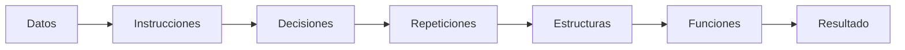

---

## 1. Ejecutar código en un notebook

Un notebook combina texto, código y resultados en celdas. Cada celda de código puede ejecutarse de forma independiente, aunque normalmente conviene avanzar de arriba hacia abajo para mantener un estado coherente.

```text
┌─────────────────────────────────────────────┐
│ Celda Markdown                              │
│ Explica una idea                            │
├─────────────────────────────────────────────┤
│ Celda de código                             │
│ nombre = "Ana"                              │
│ print(nombre)                               │
├─────────────────────────────────────────────┤
│ Salida                                      │
│ Ana                                         │
└─────────────────────────────────────────────┘
```

En Google Colab o Jupyter, una variable creada en una celda puede ser utilizada en celdas posteriores mientras el entorno continúe activo.

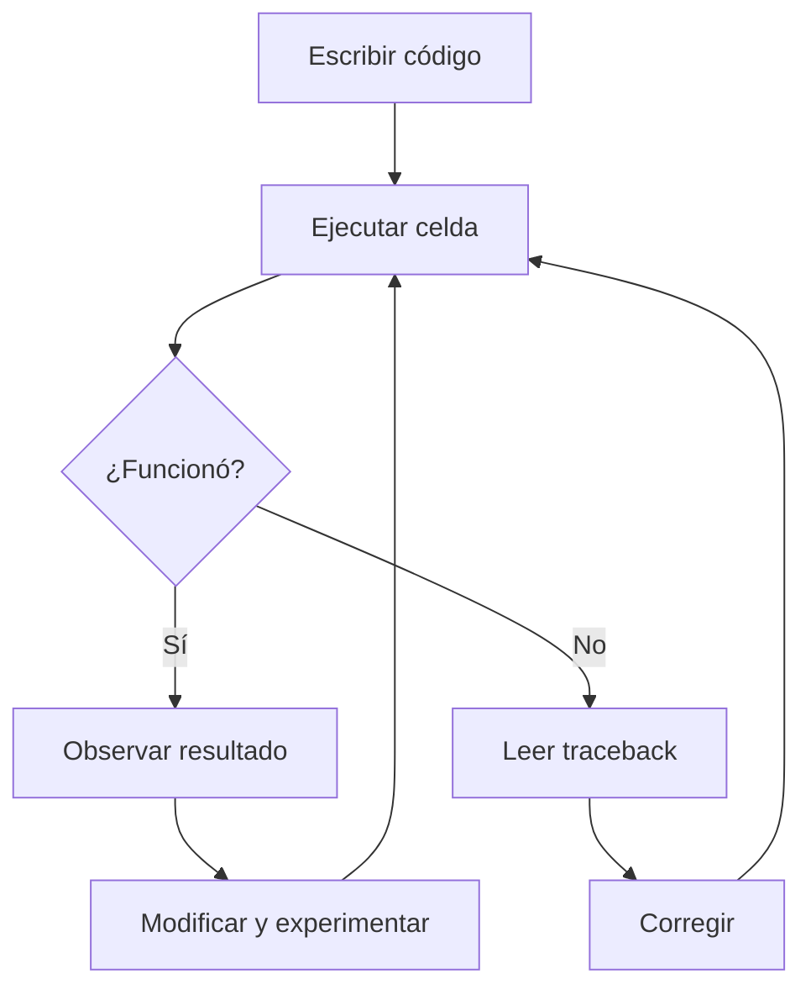

### `print()`: mostrar información

`print()` permite enviar información a la salida.

```python
print("Hola, Ciencia de Datos")
print("Estoy escribiendo mi primer programa")
```

La salida es visible, pero `print()` no almacena por sí mismo el valor mostrado.

---

## 2. Variables: nombres asociados a valores

Una variable permite asignar un nombre a un dato.

```python
nombre = "Ana"
edad = 30
altura = 1.65
```

Visualmente:

```text
nombre ─────────► "Ana"
edad   ─────────► 30
altura ─────────► 1.65
```

El símbolo `=` representa **asignación**.

```text
nombre_variable = valor
```

La variable puede reutilizarse:

```python
print(nombre)
print(edad)
print(altura)
```

### 2.1 Tipos de datos básicos

Python distingue valores según su tipo.

| Tipo | Significado | Ejemplos |
|---|---|---|
| `int` | número entero | `5`, `-3`, `100` |
| `float` | número decimal | `3.14`, `1.65` |
| `str` | texto | `"Hola"`, `"30"` |
| `bool` | valor lógico | `True`, `False` |

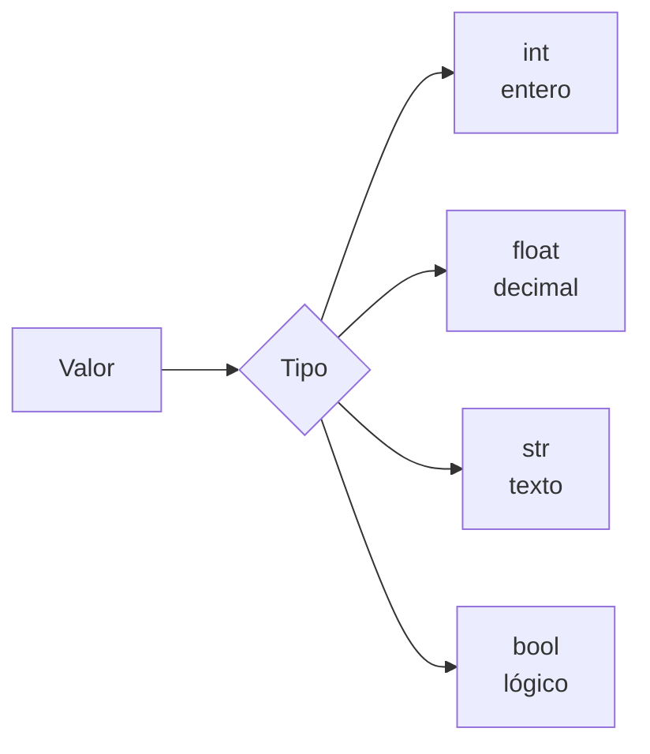

`type()` permite inspeccionar el tipo de un valor.

```python
print(type(30))
print(type("30"))
```

Aunque visualmente se parezcan, `30` y `"30"` no representan lo mismo:

```text
30       → int → número
"30"     → str → texto
```

El tipo determina qué operaciones son válidas.

---

## 3. Operadores: Python como calculadora

Los operadores aritméticos permiten construir expresiones numéricas.

| Operador | Operación | Ejemplo |
|---|---|---|
| `+` | suma | `10 + 3` |
| `-` | resta | `10 - 3` |
| `*` | multiplicación | `10 * 3` |
| `/` | división | `10 / 3` |
| `//` | división entera | `10 // 3` |
| `%` | residuo | `10 % 3` |
| `**` | potencia | `10 ** 2` |

```python
a = 10
b = 3

print(a + b)
print(a - b)
print(a * b)
print(a / b)
print(a // b)
print(a ** 2)
print(a % b)
```

### 3.1 Operaciones con texto

En cadenas de texto, algunos operadores tienen otro comportamiento.

```python
nombre = "Ana"
apellido = "García"

completo = nombre + " " + apellido
print(completo)

print("Hola! " * 3)
```

```text
"Data" + " Science"  → "Data Science"
"Hi! " * 3           → "Hi! Hi! Hi! "
```

### Tipos incompatibles

No todas las operaciones tienen sentido entre tipos diferentes.

```python
edad = 30
print("Tengo " + edad + " años")
```

El programa produce un `TypeError` porque intenta concatenar un `str` con un `int`.

Una solución es convertir el número:

```python
print("Tengo " + str(edad) + " años")
```

Otra opción más legible son las **f-strings**.

---

## 4. f-strings: combinar texto y variables

Una f-string permite insertar expresiones dentro de un texto.

```python
nombre = "Ana"
edad = 30

print(f"{nombre} tiene {edad} años")
```

La estructura es:

```text
f"texto {expresión} texto"
```

También permite formatear números.

```python
precio = 1_250_000
print(f"El total es ${precio:,}")

promedio = 4.23456
print(f"Promedio: {promedio:.2f}")

descuento = 0.15
print(f"Descuento: {descuento:.0%}")
```

| Formato | Efecto |
|---|---|
| `:,` | separador de miles |
| `:.2f` | dos cifras decimales |
| `:.0%` | porcentaje sin decimales |

---

## 5. Decisiones con `if`, `elif` y `else`

Un programa puede escoger caminos diferentes según una condición.

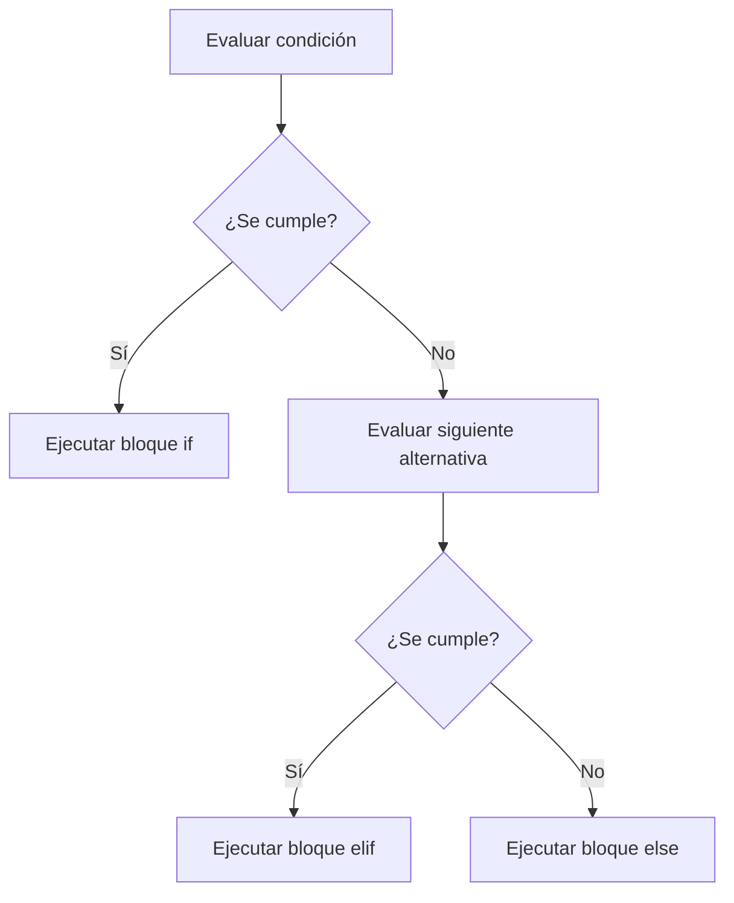

### Operadores de comparación

| Operador | Significado |
|---|---|
| `==` | igual a |
| `!=` | diferente de |
| `>` | mayor que |
| `<` | menor que |
| `>=` | mayor o igual que |
| `<=` | menor o igual que |

Ejemplo:

```python
edad = 20

if edad >= 18:
    print("Es mayor de edad")
else:
    print("Es menor de edad")
```

Con varias alternativas:

```python
edad = 15

if edad >= 18:
    print("Puede votar")
elif edad >= 13:
    print("Es adolescente")
else:
    print("Es niño o niña")
```

### 5.1 La indentación es parte de la sintaxis

Python utiliza sangría para indicar qué instrucciones pertenecen a cada bloque.

```text
if condición:
│   instrucción dentro del if
│   otra instrucción
│
└── termina el bloque al volver al margen
```

Ejemplo correcto:

```python
if edad >= 18:
    print("Puede votar")
```

Ejemplo incorrecto:

```python
if edad >= 18:
print("Puede votar")
```

La falta de indentación genera un `IndentationError`.

---

## 6. Repetición: `for` y `while`

Muchas tareas de datos requieren repetir una operación.

```text
dato 1 ─┐
dato 2 ─┼──► misma operación ───► resultados
dato 3 ─┤
dato 4 ─┘
```

### 6.1 `for`: recorrer una secuencia

`for` es apropiado cuando queremos recorrer elementos de una colección o un rango.

```python
for numero in range(1, 6):
    print(numero)
```

### `range()`

| Expresión | Valores producidos |
|---|---|
| `range(5)` | `0, 1, 2, 3, 4` |
| `range(1, 6)` | `1, 2, 3, 4, 5` |
| `range(0, 10, 2)` | `0, 2, 4, 6, 8` |

También podemos recorrer una colección:

```python
amigos = ["Ana", "Luis", "Sofía"]

for amigo in amigos:
    print(f"Hola, {amigo}!")
```

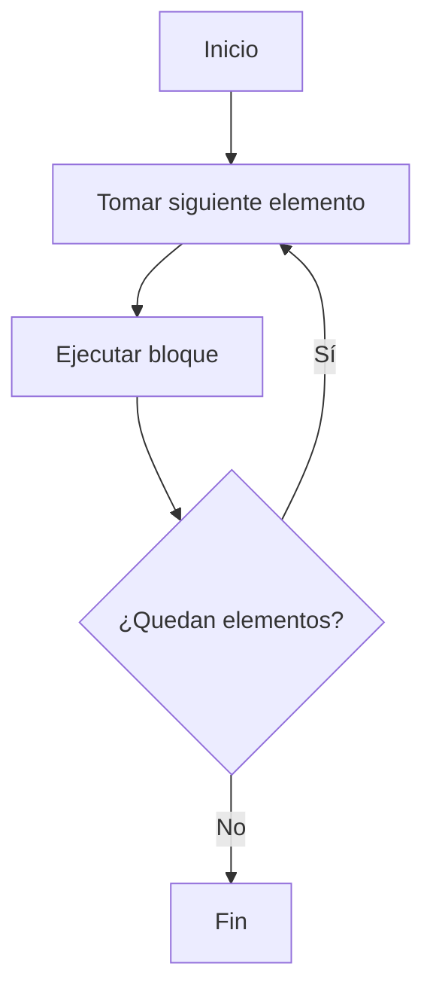

### 6.2 `while`: repetir mientras una condición sea verdadera

```python
saldo = 1000

while saldo > 0:
    print(f"Saldo actual: {saldo}")
    saldo = saldo - 300

print("Saldo agotado")
```

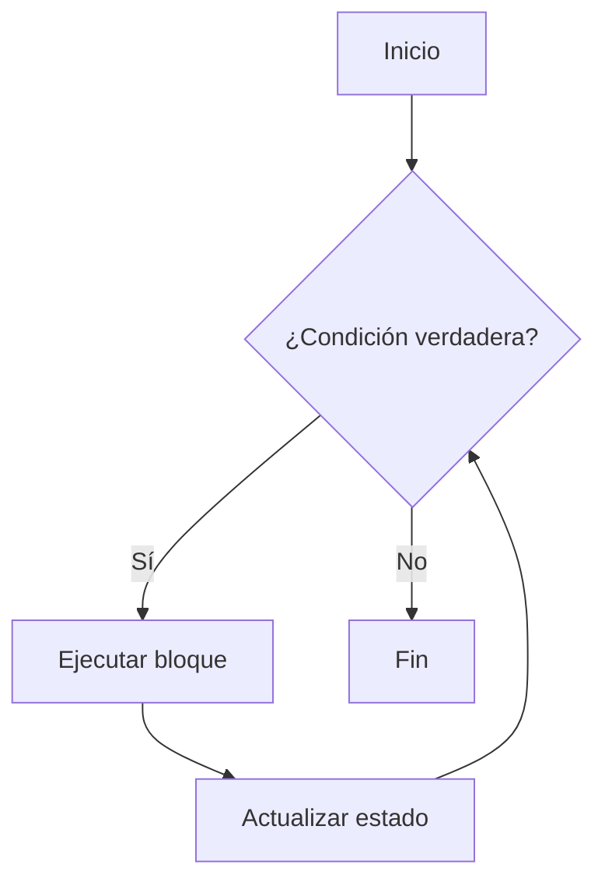

La condición debe poder cambiar. Si nunca se vuelve falsa, se produce un **bucle infinito**.

---

## 7. Listas: colecciones ordenadas y modificables

Una lista agrupa varios valores.

```python
productos = ["Café", "Pan", "Leche", "Queso"]
```

### Índices

Python comienza a contar desde `0`.

```text
índice        0        1         2         3
          ┌────────┬────────┬─────────┬─────────┐
lista  →  │ "Café" │ "Pan"  │ "Leche" │ "Queso" │
          └────────┴────────┴─────────┴─────────┘
                                         ▲
                                        -1
```

```python
print(productos[0])
print(productos[2])
print(productos[-1])
```

`len()` devuelve la cantidad de elementos:

```python
print(len(productos))
```

### 7.1 Modificar listas

| Operación | Efecto |
|---|---|
| `lista.append(x)` | agrega `x` al final |
| `lista.remove(x)` | elimina la primera aparición |
| `lista[i] = x` | reemplaza un elemento |
| `sum(lista)` | suma elementos numéricos |
| `max(lista)` | obtiene el mayor |
| `min(lista)` | obtiene el menor |
| `sorted(lista)` | devuelve una versión ordenada |

```python
precios = [3500, 1200, 4800, 12000]

precios.append(2000)
precios[0] = 4000

print(sum(precios))
print(max(precios))
print(sum(precios) / len(precios))
```

---

## 8. Tuplas: datos agrupados que no se modifican

Una tupla es una secuencia ordenada similar a una lista, pero **inmutable**.

```python
punto = (4.5, 3.2)
producto = ("Café", 3500)
```

```text
LISTA                    TUPLA
[ "Café", "Pan" ]        ( "Café", 3500 )
      │                         │
 modificable               inmutable
```

### Listas y tuplas

| Característica | Lista | Tupla |
|---|---|---|
| Sintaxis | `[ ]` | `( )` |
| Ordenada | Sí | Sí |
| Acceso por índice | Sí | Sí |
| Modificable | Sí | No |
| Uso típico | colección que cambia | registro pequeño y estable |

Las tuplas son útiles para agrupar valores relacionados:

```python
catalogo = [
    ("Café", 3500),
    ("Pan", 1200),
    ("Leche", 4800)
]
```

Python permite desempaquetar cada tupla:

```python
for nombre_producto, precio in catalogo:
    print(f"{nombre_producto}: ${precio:,}")
```

---

## 9. Diccionarios: asociar claves con valores

Un diccionario organiza datos como pares **clave: valor**.

```python
precios = {
    "Café": 3500,
    "Pan": 1200,
    "Leche": 4800
}
```

```text
┌─────────────┬─────────┐
│ clave       │ valor   │
├─────────────┼─────────┤
│ "Café"      │ 3500    │
│ "Pan"       │ 1200    │
│ "Leche"     │ 4800    │
└─────────────┴─────────┘
```

A diferencia de una lista, no buscamos por posición:

```python
print(precios["Café"])
```

Podemos agregar nuevas claves:

```python
precios["Huevos"] = 900
```

### 9.1 Recorrer un diccionario

```python
for producto, precio in precios.items():
    print(f"{producto}: ${precio:,}")
```

Métodos útiles:

| Expresión | Resultado |
|---|---|
| `diccionario.keys()` | claves |
| `diccionario.values()` | valores |
| `diccionario.items()` | pares clave-valor |

### 9.2 Claves inexistentes: `KeyError` y `.get()`

Esto falla si la clave no existe:

```python
precios["Arroz"]
```

Produce un `KeyError`.

`.get()` permite indicar un valor alternativo:

```python
precios.get("Arroz", 0)
```

También se puede verificar pertenencia:

```python
if "Arroz" in precios:
    print("Sí hay arroz")
else:
    print("No tenemos arroz")
```

---

## 10. Estructuras anidadas

Las estructuras pueden combinarse.

```python
supermercado = {
    "Frutas": [
        ("Manzana", 4500),
        ("Banano", 2800)
    ],
    "Lácteos": [
        ("Leche", 4800),
        ("Queso", 12000),
        ("Yogur", 3200)
    ]
}
```

Su forma conceptual es:

```text
supermercado
│
├── "Frutas"
│   ├── ("Manzana", 4500)
│   └── ("Banano", 2800)
│
└── "Lácteos"
    ├── ("Leche", 4800)
    ├── ("Queso", 12000)
    └── ("Yogur", 3200)
```

También puede verse como:

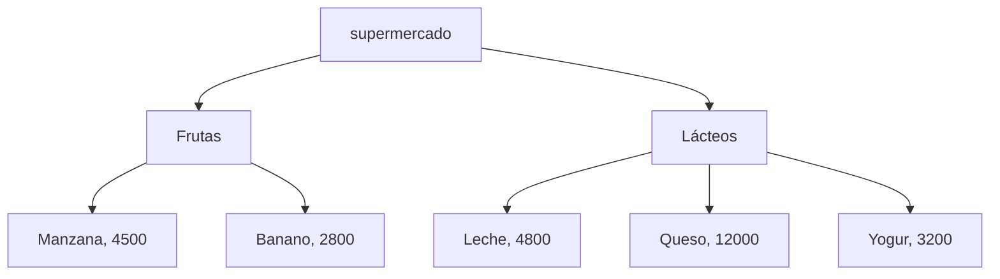

Acceder a estructuras anidadas significa avanzar nivel por nivel:

```python
supermercado["Lácteos"][0]
supermercado["Lácteos"][0][0]
```

```text
supermercado["Lácteos"]       → lista
          [0]                 → primera tupla
             [0]              → nombre del producto
```

---

## 11. Funciones: empaquetar trabajo reutilizable

Una función agrupa instrucciones bajo un nombre.

```python
def saludar(nombre):
    mensaje = f"Hola, {nombre}!"
    return mensaje
```

La estructura general es:

```python
def nombre_funcion(parametro1, parametro2):
    # instrucciones
    return resultado
```

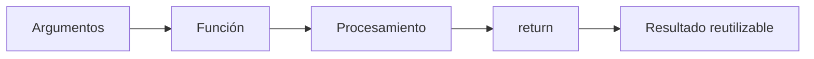

Definir una función no significa ejecutarla:

```python
def saludar(nombre):
    return f"Hola, {nombre}!"

mensaje = saludar("Ana")
```

### 11.1 Parámetros y argumentos

```text
def saludar(nombre):
            ▲
            └── parámetro

saludar("Ana")
         ▲
         └── argumento
```

### 11.2 `return` no es lo mismo que `print()`

Esta diferencia es fundamental.

```python
def sumar_mal(a, b):
    print(a + b)

def sumar_bien(a, b):
    return a + b
```

`print()`:

```text
función
  │
  └── muestra 5 en pantalla
         │
         └── no devuelve ese 5 al programa
```

`return`:

```text
función
  │
  └── devuelve 5
         │
         ├── guardarlo
         ├── multiplicarlo
         ├── compararlo
         └── pasarlo a otra función
```

Si una función no utiliza `return`, Python devuelve implícitamente `None`.

```python
resultado = sumar_mal(2, 3)
print(resultado)
# None
```

---

## 12. Combinar conceptos: de piezas aisladas a un programa

Los programas reales combinan varias estructuras y mecanismos.

```text
DICCIONARIO
     │
     ▼
categorías
     │
     ▼
LISTAS
     │
     ▼
TUPLAS (producto, precio)
     │
     ▼
FOR recorre
     │
     ▼
IF decide
     │
     ▼
FUNCIONES calculan
     │
     ▼
F-STRINGS presentan
```

Ejemplo conceptual de una cafetería:

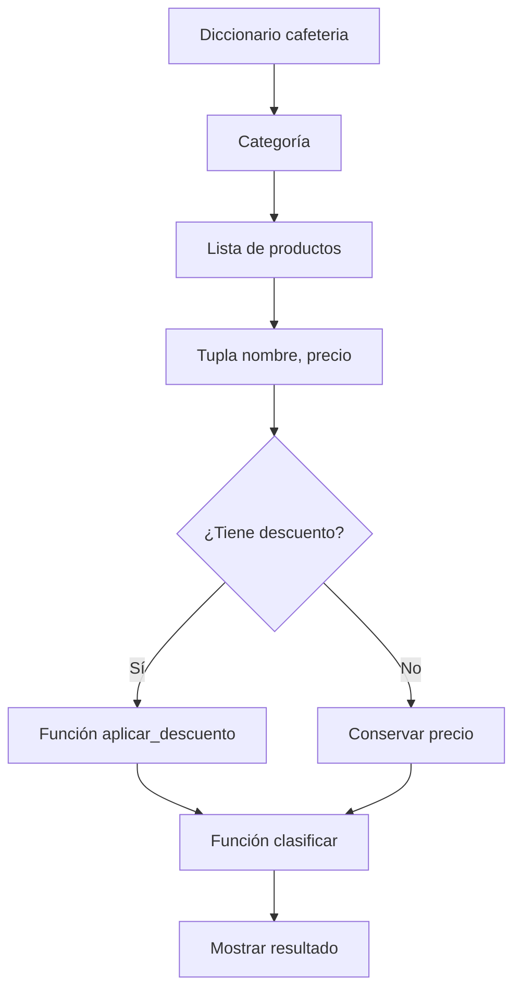

Una función para aplicar descuento:

```python
def aplicar_descuento(precio, porcentaje):
    return precio * (1 - porcentaje)
```

Una función para clasificar:

```python
def clasificar(precio):
    if precio > 5000:
        return "caro"
    else:
        return "barato"
```

El valor de estas piezas no está en cada línea aislada, sino en que pueden **componerse**.

---

## 13. Del notebook al archivo `.py`

Un notebook (`.ipynb`) y un script (`.py`) contienen código Python, pero se utilizan de manera diferente.

<div class="concept-grid" markdown="1">

<div class="concept-card" markdown="1">

### Notebook `.ipynb`

- organizado en celdas;
- combina texto, código y resultados;
- ideal para experimentar y documentar;
- muy común en análisis exploratorio.

</div>

<div class="concept-card" markdown="1">

### Script `.py`

- archivo de texto con código Python;
- pensado para ejecutar un flujo como programa;
- facilita reutilización, automatización y organización.

</div>

</div>

```text
NOTEBOOK                     SCRIPT
analysis.ipynb               inventario.py
┌───────────────┐            ┌───────────────┐
│ texto         │            │ código         │
│ código        │    →       │ funciones      │
│ resultado     │            │ flujo          │
│ gráfico       │            │ reutilizable   │
└───────────────┘            └───────────────┘
```

### `if __name__ == "__main__"`

En un script puede aparecer:

```python
if __name__ == "__main__":
    print("Ejecutando programa")
```

Este bloque permite distinguir entre:

```text
ejecutar archivo directamente
            vs.
importar sus funciones desde otro archivo
```

---

## 14. Errores frecuentes y cómo leerlos

Un traceback contiene información para localizar un problema.

```text
TRACEBACK
│
├── archivo / celda
├── línea
├── tipo de error
└── mensaje
```

### Errores trabajados en esta sesión

| Error | Significado habitual |
|---|---|
| `TypeError` | se intentó una operación entre tipos incompatibles |
| `IndentationError` | la sangría no representa correctamente el bloque |
| `IndexError` | se solicitó una posición inexistente |
| `KeyError` | se solicitó una clave inexistente |
| problema con `NoneType` | se intentó operar con un valor `None` |

### Estrategia básica de depuración

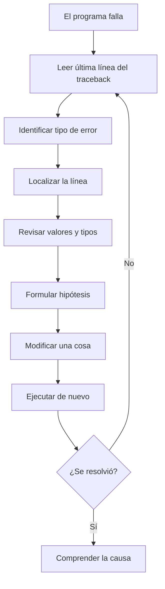

> Un error no solo dice que algo falló: aporta evidencia sobre el estado del programa.

---

## 15. Mapa conceptual de la sesión

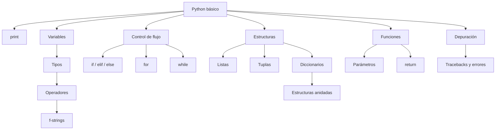

---

## 16. Hoja rápida de referencia

```python
# Mostrar
print("Hola")

# Variables
edad = 30
nombre = "Ana"

# Tipo
type(edad)

# f-string
print(f"{nombre} tiene {edad} años")

# Decisión
if edad >= 18:
    print("Mayor de edad")
else:
    print("Menor de edad")

# for
for numero in range(5):
    print(numero)

# while
saldo = 3
while saldo > 0:
    saldo -= 1

# Lista
productos = ["Café", "Pan"]
productos.append("Leche")

# Tupla
producto = ("Café", 3500)

# Diccionario
precios = {"Café": 3500}
precio = precios.get("Café", 0)

# Función
def doble(numero):
    return numero * 2
```

---

## 17. Comprueba tu comprensión

### Nivel 1 — Reconocer y aplicar

1. ¿Por qué `30` y `"30"` tienen comportamientos distintos?
2. ¿Qué diferencia existe entre `=` y `==`?
3. ¿Por qué Python necesita indentación en un `if`?
4. ¿Cuándo usarías `for` y cuándo `while`?

### Nivel 2 — Comparar

1. ¿Qué diferencia práctica existe entre una lista y una tupla?
2. ¿Por qué un diccionario permite modelar mejor algunos datos que una lista?
3. ¿Por qué `.get()` puede ser más seguro que `diccionario[clave]`?
4. ¿Qué diferencia funcional existe entre `print()` y `return`?

### Nivel 3 — Diseñar

Imagina una tienda con categorías y productos.

```text
tienda
│
├── Bebidas
│   ├── ("Café", 3500)
│   └── ("Jugo", 5000)
│
└── Panadería
    ├── ("Pan", 1200)
    └── ("Croissant", 4500)
```

Piensa qué combinación de:

- diccionario;
- listas;
- tuplas;
- ciclos;
- condicionales;
- funciones;

usarías para calcular precios promedio, aplicar descuentos y clasificar productos.

---

## 18. Ejercicios de refuerzo

### 🟢 Ejercicio 1

Crea una lista de cinco precios y calcula:

- total;
- promedio;
- mayor;
- menor.

Pistas:

```python
sum()
len()
max()
min()
```

### 🟡 Ejercicio 2

Escribe una función:

```python
contar_pares(lista)
```

que devuelva cuántos números pares contiene una lista.

Recuerda:

```python
numero % 2 == 0
```

### 🔴 Ejercicio 3

Dado un diccionario de categorías con productos y precios, construye:

```python
categoria_mas_cara()
```

que devuelva la categoría cuyo precio promedio sea mayor.

---

## 19. Qué debes poder explicar al finalizar

- qué es una variable y cómo se relaciona con un tipo de dato;
- por qué el tipo afecta las operaciones disponibles;
- cómo una condición permite elegir un camino;
- cómo `for` y `while` permiten repetir;
- cómo listas, tuplas y diccionarios representan información de formas distintas;
- cómo combinar estructuras para modelar datos más complejos;
- por qué una función permite reutilizar una solución;
- por qué `return` y `print()` no son equivalentes;
- cómo utilizar un traceback como fuente de información;
- qué diferencia conceptual existe entre trabajar en un notebook y en un archivo `.py`.

---

## 20. Instalar Python, VS Code y Jupyter

Esta sección te ayuda a preparar un entorno local para trabajar con notebooks en Windows, Linux o macOS. El flujo recomendado es:

```text
Python
  ↓
VS Code
  ↓
Extensión de Python + extensión de Jupyter + Pylance
  ↓
Carpeta del proyecto
  ↓
Entorno virtual
  ↓
Notebook de Jupyter
```

### 20.1. Instalar Python

#### Windows

1. Descarga Python desde [python.org/downloads](https://www.python.org/downloads/).
2. Ejecuta el instalador.
3. Marca **Add Python to PATH**.
4. Selecciona **Install Now**.

Después de instalar, abre una terminal nueva y verifica:

```powershell
python --version
python -m pip --version
```

#### Linux

En Ubuntu, Debian o Linux Mint:

```bash
sudo apt update
sudo apt install python3 python3-pip python3-venv
```

En Fedora:

```bash
sudo dnf install python3 python3-pip
```

En Arch Linux o Manjaro:

```bash
sudo pacman -S python python-pip
```

Luego verifica:

```bash
python3 --version
python3 -m pip --version
```

#### macOS con Homebrew

Si no tienes Homebrew, instálalo desde [brew.sh](https://brew.sh/).

Después instala Python:

```bash
brew install python
```

Verifica:

```bash
python3 --version
python3 -m pip --version
```

### 20.2. Instalar Visual Studio Code

#### Windows y Linux

1. Descarga VS Code desde [code.visualstudio.com](https://code.visualstudio.com/).
2. Ejecuta el instalador correspondiente a tu sistema operativo.
3. En Windows, selecciona **Add to PATH** si el instalador muestra esa opción.

#### macOS con Homebrew

```bash
brew install --cask visual-studio-code
```

### 20.3. Instalar las extensiones necesarias de VS Code

Abre el panel de extensiones en VS Code:

| Sistema | Atajo |
|---|---|
| Windows y Linux | `Ctrl + Shift + X` |
| macOS | `Cmd + Shift + X` |

Instala estas extensiones publicadas por Microsoft:

- **Python**;
- **Jupyter**;
- **Pylance**.

### 20.4. Crear y abrir la carpeta del proyecto

Crea una carpeta para el curso, por ejemplo:

```text
curso-jupyter
```

En VS Code, abre:

```text
File → Open Folder
```

También puedes crearla y abrirla desde la terminal.

#### Windows, Linux y macOS

```bash
mkdir curso-jupyter
cd curso-jupyter
code .
```

### 20.5. Crear el entorno virtual

Abre la terminal integrada de VS Code:

```text
Terminal → New Terminal
```

#### Windows

Crea el entorno:

```powershell
python -m venv .venv
```

Antes de activarlo, permite temporalmente la ejecución de scripts en la terminal actual:

```powershell
Set-ExecutionPolicy -Scope Process -ExecutionPolicy Bypass
```

Activa el entorno:

```powershell
.venv\Scripts\Activate.ps1
```

#### Linux

Crea el entorno:

```bash
python3 -m venv .venv
```

Actívalo:

```bash
source .venv/bin/activate
```

#### macOS

Crea el entorno:

```bash
python3 -m venv .venv
```

Actívalo:

```bash
source .venv/bin/activate
```

Cuando el entorno esté activo, `(.venv)` aparecerá al comienzo de la línea de la terminal.

### 20.6. Instalar Jupyter y librerías de datos

Con el entorno virtual activado, instala Jupyter:

```bash
python -m pip install jupyter ipykernel
```

Para trabajar con análisis de datos, instala:

```bash
python -m pip install numpy pandas matplotlib seaborn scikit-learn openpyxl
```

Estos dos comandos son iguales en Windows, Linux y macOS una vez el entorno virtual está activo.

### 20.7. Seleccionar el intérprete de Python en VS Code

Abre la paleta de comandos:

| Sistema | Atajo |
|---|---|
| Windows y Linux | `Ctrl + Shift + P` |
| macOS | `Cmd + Shift + P` |

Selecciona:

```text
Python: Select Interpreter
→ Python (.venv)
```

Si aparecen varios intérpretes, selecciona el que esté dentro de la carpeta `.venv`.

Rutas comunes:

| Sistema | Ruta del intérprete |
|---|---|
| Windows | `.venv\Scripts\python.exe` |
| Linux y macOS | `.venv/bin/python` |

### 20.8. Crear y ejecutar un notebook

Crea un archivo llamado:

```text
actividad.ipynb
```

En la esquina superior derecha del notebook, selecciona:

```text
Select Kernel
→ Python Environments
→ Python (.venv)
```

Para ejecutar una celda:

| Sistema | Atajo |
|---|---|
| Windows, Linux y macOS | `Shift + Enter` |

### 20.9. Resumen de comandos

#### Windows

```powershell
python -m venv .venv
Set-ExecutionPolicy -Scope Process -ExecutionPolicy Bypass
.venv\Scripts\Activate.ps1
python -m pip install jupyter ipykernel
python -m pip install numpy pandas matplotlib seaborn scikit-learn openpyxl
```

#### Linux

```bash
python3 -m venv .venv
source .venv/bin/activate
python -m pip install jupyter ipykernel
python -m pip install numpy pandas matplotlib seaborn scikit-learn openpyxl
```

#### macOS con Homebrew

```bash
brew install python
brew install --cask visual-studio-code
python3 -m venv .venv
source .venv/bin/activate
python -m pip install jupyter ipykernel
python -m pip install numpy pandas matplotlib seaborn scikit-learn openpyxl
```

<div class="callout callout-success" markdown="1">

### Verificación rápida

Antes de iniciar los ejercicios, confirma:

- VS Code abre la carpeta del proyecto;
- la terminal muestra `(.venv)`;
- el intérprete seleccionado está dentro de `.venv`;
- el kernel del notebook es **Python (.venv)**;
- una celda con `print("Hola, Ciencia de Datos")` se ejecuta correctamente.

</div>

---

## Próxima sesión

La siguiente sesión lleva estas ideas hacia **NumPy** y la computación numérica: representar los mismos datos con estructuras diseñadas para realizar operaciones numéricas de forma más eficiente.

```text
Python básico
     │
     ▼
listas y estructuras
     │
     ▼
NumPy arrays
     │
     ▼
operaciones numéricas sobre datos
```
