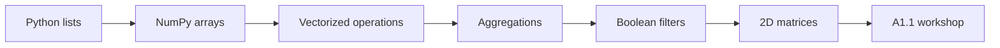

# Data Science Programming — Session 2
## NumPy and A1.1 workshop: arrays, vectors, filters, and axes

This session moves from Python lists to NumPy arrays. The goal is to understand why numerical data work needs arrays, how vectorized operations replace many loops, and how these ideas connect with the first activity through small pandas and matplotlib tasks.

> **Core idea:** NumPy lets us operate on complete groups of numbers at once, with readable code and better performance.



---

## 1. What we will do

The guided notebook develops the following route:

| Part | Focus | Main idea |
|---|---|---|
| 1 | Python lists | Lists are useful, but they do not behave like numerical vectors. |
| 2 | NumPy arrays | Arrays store homogeneous numerical data with shape, dimension, and type. |
| 3 | Vectorization | Operations run over many values without writing a loop for every element. |
| 4 | Aggregation | Many numbers can be summarized with operations such as sum, mean, min, and max. |
| 5 | Boolean filtering | Conditions create masks that select only the values that satisfy a rule. |
| 6 | Two dimensions | Matrices model tables of numbers, rows, columns, and axes. |
| 7 | A1.1 workshop | pandas and matplotlib are used for the minimum workflow needed in Activity 1. |

Run the notebook from top to bottom with `Shift + Enter`. Change values, execute cells again, and read tracebacks carefully when something fails.

---

## 2. Install and import the libraries

The practice uses NumPy, pandas, and matplotlib. If the libraries are not installed in the active environment, run:

```python
%pip install numpy pandas matplotlib --quiet
```

Then import NumPy with the standard alias:

```python
import numpy as np
```

The alias `np` is used across documentation, examples, and most data science projects.

---

## 3. From lists to arrays

A Python list stores values, but multiplying a list does not multiply each value. It repeats the list.

```python
prices = [100, 200, 300, 400]
print(prices * 2)
```

A NumPy array behaves like a numerical vector:

```python
prices = np.array([100, 200, 300, 400])

print(prices * 2)
print(prices.dtype)
print(prices.shape)
print(prices.ndim)
```

Key vocabulary:

| Concept | Meaning |
|---|---|
| `dtype` | Type of the stored values. |
| `shape` | Size of each dimension. |
| `ndim` | Number of dimensions. |
| `size` | Total number of elements. |

---

## 4. Vectorization

Vectorization means writing one expression that applies to all elements of an array.

```python
prices = np.array([100, 200, 300, 400])
units = np.array([2, 1, 5, 3])

with_tax = prices * 1.19
line_totals = prices * units

print(with_tax)
print(line_totals)
```

This is the mental shift for the session: instead of asking "how do I loop over each value?", ask "which array operation represents the complete transformation?".

---

## 5. Aggregation and axes

Aggregation reduces several values into a summary value.

```python
sales = np.array([12, 18, 9, 21, 15])

print(sales.sum())
print(sales.mean())
print(sales.min())
print(sales.max())
```

In two dimensions, `axis` indicates the direction that collapses:

```python
matrix = np.array([
    [10, 12, 9],
    [8, 11, 14],
    [13, 15, 16]
])

print(matrix.sum(axis=0))  # summary by column
print(matrix.sum(axis=1))  # summary by row
```

Read `axis=0` and `axis=1` slowly. Most mistakes in matrix exercises come from collapsing the wrong direction.

---

## 6. Boolean filtering

A comparison over an array produces a boolean mask.

```python
sales = np.array([12, 18, 9, 21, 15])
mask = sales >= 15

print(mask)
print(sales[mask])
```

For compound conditions, use `&`, `|`, and parentheses:

```python
filtered = sales[(sales >= 12) & (sales <= 20)]
print(filtered)
```

With arrays, do not use `and` or `or` for element-by-element conditions.

---

## 7. A1.1 workshop

The guided notebook connects Session 1 dictionaries with a small data workflow:

1. Move from a dictionary to parallel lists.
2. Use NumPy to calculate discounts and classifications.
3. Build a pandas `DataFrame`.
4. Add calculated columns.
5. Create a bar chart with matplotlib.
6. Prepare the Activity 1 delivery.

```python
import pandas as pd
import matplotlib.pyplot as plt

products = ["Rice", "Beans", "Milk"]
units = np.array([12, 8, 15])
prices = np.array([3500, 4200, 3800])

df = pd.DataFrame({
    "product": products,
    "units": units,
    "price": prices,
    "total": units * prices
})

df.plot(kind="bar", x="product", y="total")
plt.show()
```

---

## 8. Practice notebooks

Download the version that matches your current route:

| Notebook | Use it when... |
|---|---|
| Student Practice | You want the guided session with explanations, examples, and the A1.1 workshop. |
| Advanced Practice | You already program and want vectorized NumPy challenges without Python loops. |

The advanced notebook works with six products across twelve months and asks you to solve challenges with standardization, classification, broadcasting, top values, moving windows, and anomaly detection.

---

## 9. Before the next session

Complete the assigned practice before Tuesday, September 8, 2026:

| Task | Expected result |
|---|---|
| NumPy climate data | Practice arrays, filtering, aggregation, and axes on a small dataset. |
| Activity 1 | Finish the required pandas and matplotlib delivery. |
| Reflection | Explain which NumPy mistake was easiest to make and how you detected it. |

---

## Summary

By the end of this session, you should be able to:

- Create NumPy arrays and inspect their type, shape, dimension, and size.
- Replace simple loops with vectorized operations.
- Summarize arrays with aggregation functions.
- Filter arrays with boolean masks and compound conditions.
- Read two-dimensional data by row, column, and axis.
- Connect NumPy calculations with a small pandas and matplotlib workflow.
