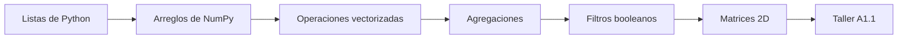

# Data Science Programming — Sesión 2
## NumPy y taller A1.1: arreglos, vectores, filtros y ejes

Esta sesión pasa de las listas de Python a los arreglos de NumPy. El objetivo es comprender por qué el trabajo con datos numéricos necesita arreglos, cómo las operaciones vectorizadas reemplazan muchos ciclos y cómo estas ideas se conectan con la primera actividad mediante tareas pequeñas con pandas y matplotlib.

> **Idea central:** NumPy permite operar grupos completos de números de una sola vez, con código legible y mejor rendimiento.



---

## 1. Qué haremos

El notebook guiado desarrolla la siguiente ruta:

| Parte | Enfoque | Idea principal |
|---|---|---|
| 1 | Listas de Python | Las listas son útiles, pero no se comportan como vectores numéricos. |
| 2 | Arreglos de NumPy | Los arreglos almacenan datos numéricos homogéneos con forma, dimensión y tipo. |
| 3 | Vectorización | Las operaciones se ejecutan sobre muchos valores sin escribir un ciclo por cada elemento. |
| 4 | Agregación | Muchos números se pueden resumir con operaciones como suma, promedio, mínimo y máximo. |
| 5 | Filtrado booleano | Las condiciones crean máscaras que seleccionan solo los valores que cumplen una regla. |
| 6 | Dos dimensiones | Las matrices modelan tablas de números, filas, columnas y ejes. |
| 7 | Taller A1.1 | pandas y matplotlib se usan para el flujo mínimo requerido en la Actividad 1. |

Ejecuta el notebook de arriba hacia abajo con `Shift + Enter`. Cambia valores, vuelve a ejecutar las celdas y lee con atención los tracebacks cuando algo falle.

---

## 2. Instalar e importar las librerías

La práctica usa NumPy, pandas y matplotlib. Si las librerías no están instaladas en el entorno activo, ejecuta:

```python
%pip install numpy pandas matplotlib --quiet
```

Después importa NumPy con el alias estándar:

```python
import numpy as np
```

El alias `np` se usa en la documentación, en los ejemplos y en la mayoría de proyectos de ciencia de datos.

---

## 3. De listas a arreglos

Una lista de Python almacena valores, pero multiplicar una lista no multiplica cada valor. Lo que hace es repetir la lista.

```python
precios = [100, 200, 300, 400]
print(precios * 2)
```

Un arreglo de NumPy se comporta como un vector numérico:

```python
precios = np.array([100, 200, 300, 400])

print(precios * 2)
print(precios.dtype)
print(precios.shape)
print(precios.ndim)
```

Vocabulario clave:

| Concepto | Significado |
|---|---|
| `dtype` | Tipo de los valores almacenados. |
| `shape` | Tamaño de cada dimensión. |
| `ndim` | Número de dimensiones. |
| `size` | Cantidad total de elementos. |

---

## 4. Vectorización

Vectorizar significa escribir una expresión que se aplica a todos los elementos de un arreglo.

```python
precios = np.array([100, 200, 300, 400])
unidades = np.array([2, 1, 5, 3])

con_iva = precios * 1.19
totales = precios * unidades

print(con_iva)
print(totales)
```

Este es el cambio mental de la sesión: en lugar de preguntar "¿cómo recorro cada valor?", pregunta "¿qué operación sobre arreglos representa la transformación completa?".

---

## 5. Agregación y ejes

Agregar significa reducir varios valores a un valor resumen.

```python
ventas = np.array([12, 18, 9, 21, 15])

print(ventas.sum())
print(ventas.mean())
print(ventas.min())
print(ventas.max())
```

En dos dimensiones, `axis` indica la dirección que se colapsa:

```python
matriz = np.array([
    [10, 12, 9],
    [8, 11, 14],
    [13, 15, 16]
])

print(matriz.sum(axis=0))  # resumen por columna
print(matriz.sum(axis=1))  # resumen por fila
```

Lee `axis=0` y `axis=1` con calma. La mayoría de errores en ejercicios con matrices aparece por colapsar la dirección equivocada.

---

## 6. Filtrado booleano

Una comparación sobre un arreglo produce una máscara booleana.

```python
ventas = np.array([12, 18, 9, 21, 15])
mascara = ventas >= 15

print(mascara)
print(ventas[mascara])
```

Para condiciones compuestas, usa `&`, `|` y paréntesis:

```python
filtradas = ventas[(ventas >= 12) & (ventas <= 20)]
print(filtradas)
```

Con arreglos, no uses `and` ni `or` para condiciones elemento a elemento.

---

## 7. Taller A1.1

El notebook guiado conecta los diccionarios de la Sesión 1 con un pequeño flujo de datos:

1. Pasar de un diccionario a listas paralelas.
2. Usar NumPy para calcular descuentos y clasificaciones.
3. Construir un `DataFrame` de pandas.
4. Agregar columnas calculadas.
5. Crear un gráfico de barras con matplotlib.
6. Preparar la entrega de la Actividad 1.

```python
import pandas as pd
import matplotlib.pyplot as plt

productos = ["Arroz", "Frijol", "Leche"]
unidades = np.array([12, 8, 15])
precios = np.array([3500, 4200, 3800])

df = pd.DataFrame({
    "producto": productos,
    "unidades": unidades,
    "precio": precios,
    "total": unidades * precios
})

df.plot(kind="bar", x="producto", y="total")
plt.show()
```

---

## 8. Notebooks de práctica

Descarga la versión que corresponda a tu ruta actual:

| Notebook | Úsalo cuando... |
|---|---|
| Práctica estudiantes | Quieres la sesión guiada con explicaciones, ejemplos y el taller A1.1. |
| Práctica avanzada | Ya programas y quieres retos vectorizados de NumPy sin ciclos de Python. |

El notebook avanzado trabaja con seis productos durante doce meses y propone retos de estandarización, clasificación, broadcasting, valores superiores, ventanas móviles y detección de anomalías.

---

## 9. Antes de la siguiente sesión

Completa la práctica asignada antes del martes 8 de septiembre de 2026:

| Tarea | Resultado esperado |
|---|---|
| Datos de clima con NumPy | Practicar arreglos, filtrado, agregación y ejes con un conjunto de datos pequeño. |
| Actividad 1 | Terminar la entrega requerida con pandas y matplotlib. |
| Reflexión | Explicar qué error de NumPy fue más fácil de cometer y cómo lo detectaste. |

---

## Resumen

Al terminar esta sesión, deberías poder:

- Crear arreglos de NumPy e inspeccionar su tipo, forma, dimensión y tamaño.
- Reemplazar ciclos simples con operaciones vectorizadas.
- Resumir arreglos con funciones de agregación.
- Filtrar arreglos con máscaras booleanas y condiciones compuestas.
- Leer datos bidimensionales por fila, columna y eje.
- Conectar cálculos de NumPy con un flujo pequeño de pandas y matplotlib.
